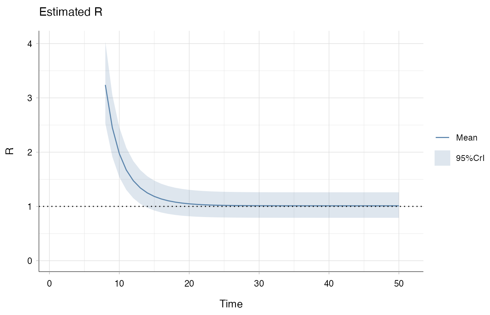
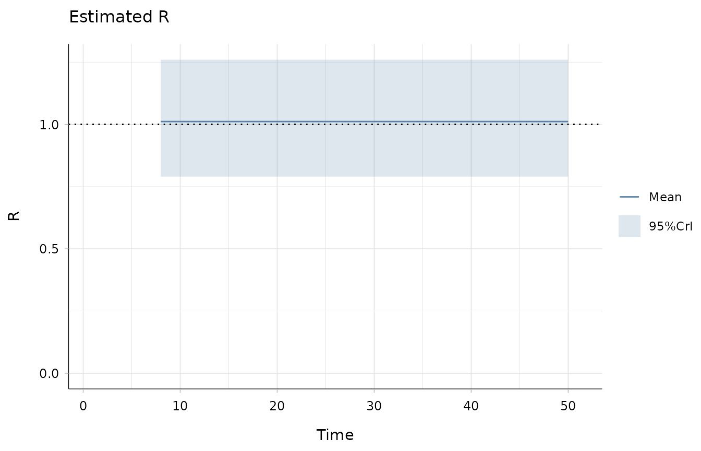
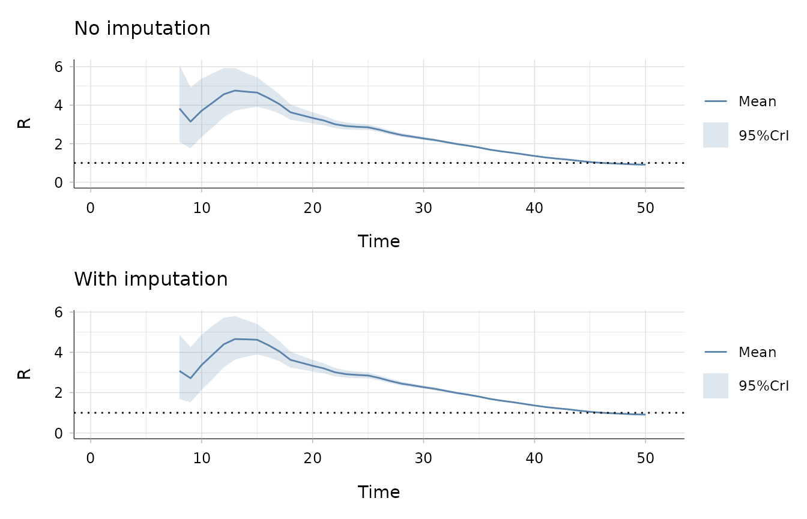
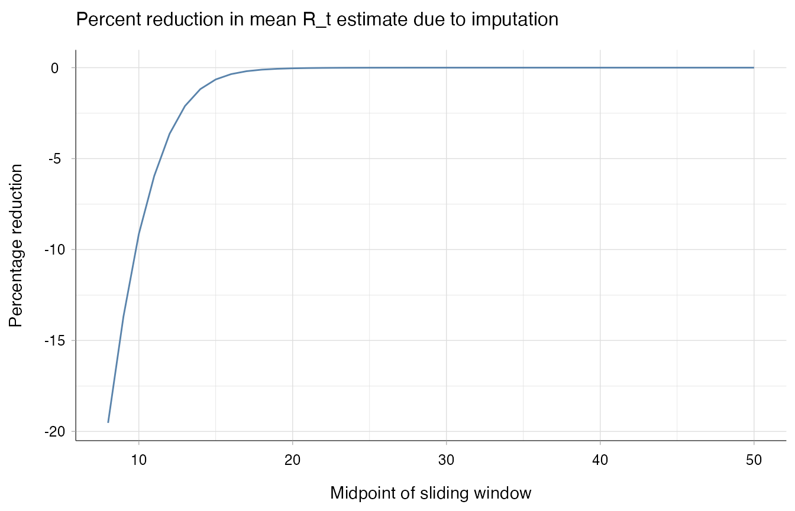
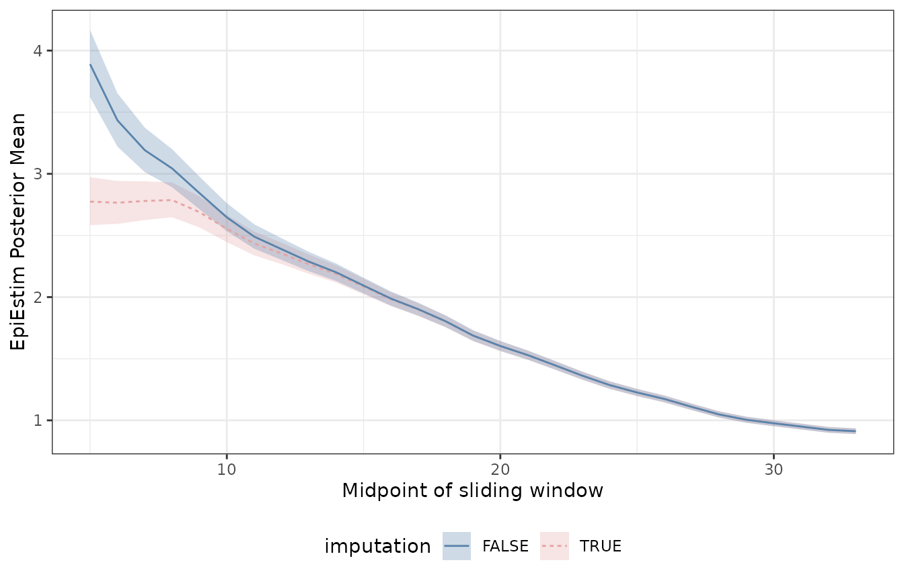

# Dealing with missed generations of infections with EpiEstim

## Background

When a novel pathogen arises in a population, time may be needed before
surveillance systems are set up and can identify infected individuals.
As such, the start of an epidemic may differ from the date of first
reported case, and epidemiologists may need to take into account the
impact of unobserved generations of infections on their analyses.

In the case of EpiEstim, the first estimates of the reproduction number
(R_(t)) are sensitive to the recent incidence history. Indeed, the
denominator of the estimator depends on the term:
``` math
\Lambda_t = \sum_{\tau < t} w_{t-\tau} I_\tau,
```
where $`(I_t)_{t}`$ denotes incidence and $`(w_j)_{j}`$ the serial
interval distribution. If the first cases are not observed, this sum
will be truncated, hence the denominator will be underestimated and
infectiousness overestimated.

In Brizzi, O’Driscoll and Dorigatti (10.1093/cid/ciac138), we proposed a
simple exponential growth model to impute missed generations of
infections, leading to a reduction in bias in early R_(t) estimates.
This can now be implemented through `EpiEstim`’s `estimate_R` function,
by setting the `backimputation_window` to an integer greater than 2,
specifying the number of observations used to fit the exponential growth
model.

In short, the method combines the strength of the exponential growth to
estimate the basic reproduction number R₀ together with the capabilities
of EpiEstim to detect changes in transmission dynamics.

## Why do we need backimputation?

### A simple toy scenario

To quickly introduce early overestimation issue, consider the case of
constant incidence, for example $`I_t = 10`$. We would expect R_(t) to
be constantly close to 1. However, estimates of R_(t) are decreasing,
suggesting a reduction in pathogen infectiousness.

``` r

incid_constant <- rep(10, 50)
config <- make_config(list(mean_si = 7, std_si = 4))
estimate_R(incid = incid_constant, config = config, method = "parametric_si") |> 
    plot("R")
#> Default config will estimate R on weekly sliding windows.
#>     To change this change the t_start and t_end arguments.
#> Warning: The `size` argument of `element_line()` is deprecated as of ggplot2 3.4.0.
#> ℹ Please use the `linewidth` argument instead.
#> ℹ The deprecated feature was likely used in the EpiEstim package.
#>   Please report the issue at <https://github.com/mrc-ide/EpiEstim/issues>.
#> This warning is displayed once per session.
#> Call `lifecycle::last_lifecycle_warnings()` to see where this warning was
#> generated.
```



The problem here is that EpiEstim implicitly assumes the 10 cases in day
2 to have been generated by cases in day 1! If this seems like an
unlikely scenario, perform backimputation by setting `imputation_window`
to an integer larger than 2. When working with daily incidence, we
suggest to set this window to at least 5 observations.

``` r

estimate_R(
    incid = incid_constant,
    backimputation_window = 7,
    config = config,
    method = "parametric_si") |> 
    plot("R")
#> Default config will estimate R on weekly sliding windows.
#>     To change this change the t_start and t_end arguments.
```



In this case, the estimates are constant, as expected.

### Real world scenario: UK COVID deaths

Let us now consider some real world data: UK COVID-19 deaths from 2020.
As reporting of deaths is more accurate and reliable than case
reporting, it is unlikely that a large proportion of people died of
COVID before the first reported death. However, we can use this dataset
to show how left-censoring incidence may affect traditional EpiEstim
estimates, and how the adjustment behaves more robustly. We focus on the
first 50 days of reports.

``` r

data(covid_deaths_2020_uk)
max_t <- 50
incid_covid <- covid_deaths_2020_uk$incidence$Incidence[1:max_t]
config_covid <- make_config(list(si_distr = covid_deaths_2020_uk$si_distr))
```

#### No left-censoring: early R_(t) estimates remain similar

We first consider a scenario where the back-imputation shouldn’t be
necessary: i.e. when no generations of infections (or deaths) are
missed. We would hope that performing back-imputation would not
drastically lower the estimates for the reproduction number. Indeed,
this is the case.

``` r

no_truncation_no_imputation <- estimate_R(
                                          incid = incid_covid,
                                          method = "non_parametric_si",
                                          config =  config_covid
)
#> Default config will estimate R on weekly sliding windows.
#>     To change this change the t_start and t_end arguments.
no_truncation_with_imputation <- estimate_R(
                                            backimputation_window = 8,
                                            incid = incid_covid,
                                            method = "non_parametric_si",
                                            config =  config_covid
)
#> Default config will estimate R on weekly sliding windows.
#>     To change this change the t_start and t_end arguments.
p1 <- plot(no_truncation_no_imputation, "R") + ggtitle("No imputation")
p2 <- plot(no_truncation_with_imputation, "R") + ggtitle("With imputation")

p1 / p2
```



The reduction in R_(t) estimates is strongest in the early stages, and
vanishes with time.

``` r

time <- no_truncation_no_imputation$R[, c("t_start", "t_end")]
estimates <- data.frame(
  x = time$t_end,
  original = no_truncation_no_imputation$R[, "Mean(R)"],
  adjusted = no_truncation_with_imputation$R[, "Mean(R)"]
)

ggplot(estimates, aes(x=x, y=(adjusted-original)/original * 100 )) +
  geom_line(colour="#5983AB") +
  theme_epiestim() +
  labs(
     title = "Percent reduction in mean R_t estimate due to imputation",
     x = "Midpoint of sliding window",
     y = "Percentage reduction"
  )
```



In this case, the shape of the R_(t) estimates are similar for the two
methods. Still, the imputation reduces the first R_(t) estimate from 3.8
to 3.1.

#### Left-censoring: back-imputation reduces bias.

Now let us assume the first two weeks of deaths were not observed. How
would the two methods compare?

``` r


trunc_t <- 14

# fit EpiEstim
truncation_no_imputation <- estimate_R(
                                     incid = incid_covid[ -(1:trunc_t)], 
                                     method = "non_parametric_si",
                                     config = config_covid
)
#> Default config will estimate R on weekly sliding windows.
#>     To change this change the t_start and t_end arguments.

truncation_with_imputation <- estimate_R(
                                   backimputation_window = 10,
                                   incid = incid_covid[ -(1:trunc_t)],
                                   method = "non_parametric_si",
                                   config = config_covid
)
#> Default config will estimate R on weekly sliding windows.
#>     To change this change the t_start and t_end arguments.

# specify classes
truncation_with_imputation$R$imputation <- TRUE
truncation_no_imputation$R$imputation <- FALSE

res1 <- truncation_with_imputation$R
res2 <- truncation_no_imputation$R

test <- data.frame(x = (res1$t_start + res1$t_end)/2, 
                     y = res1$`Mean(R)`,
                     ymin = res1$`Quantile.0.025(R)`,
                     ymax = res1$`Quantile.0.975(R)`, 
                     imputation = res1$imputation)
  
test2 <- data.frame(x = (res2$t_start + res2$t_end)/2, 
                     y = res2$`Mean(R)`,
                     ymin = res2$`Quantile.0.025(R)`,
                     ymax = res2$`Quantile.0.975(R)`, 
                     imputation = res2$imputation)
  
ggplot(test, aes( 
                          x = x,
                          y = y,
                          ymin = ymin,
                          ymax = ymax,
                          color = imputation,
                          fill = imputation,
                          linetype = imputation
                          )) + 
        geom_ribbon(alpha = .3, color = NA) +
        geom_ribbon(data = test2, alpha = .3, color = NA) +
        geom_line() +
        scale_color_manual(values=c("#5983AB", "#E5A3A3")) +
        scale_fill_manual(values=c("#5983AB", "#E5A3A3")) +
        labs(x = "Midpoint of sliding window", y = "EpiEstim Posterior Mean") +
        theme_epiestim() +
        geom_line(data = test2) +
        labs(x = "Midpoint of sliding window", y = "EpiEstim Posterior Mean") +
        theme_bw() +
        theme(legend.position = "bottom")
```



With truncated deaths data, the imputation procedure brought the R_(t)
mean estimate from 3.9 to 2.8 . This is closer to the estimate obtained
from the complete data at the same time point (3).

## Caveats

The back imputation process is not always necessary, and is not
suggested in the following cases.

1.  Surveillance is timely set up and case reporting is precise: the
    first reported cases are likely the first generations of infections.
2.  The majority of new cases are imported, hence were not generated by
    unseen local infections. In this case, refer to the “Specifying
    imported cases” section of the [original
    demo](https://mrc-ide.github.io/EpiEstim/articles/short_demo.md).  
3.  Cases are sparsely reported, with frequent 0 cases. The exponential
    growth regime may not have started, or other reporting biases may
    lead to sensitive estimates of the growth rate.

### References

Andrea Brizzi, Megan O’Driscoll, Ilaria Dorigatti, Refining Reproduction
Number Estimates to Account for Unobserved Generations of Infection in
Emerging Epidemics, Clinical Infectious Diseases, Volume 75, Issue 1, 1
July 2022, Pages e114–e121, <https://doi.org/10.1093/cid/ciac138>
