# EpiEstim demonstration

## Overview

This vignette provides a short demonstration of the package. We consider
a dataset containing information on pandemic influenza. The dataset
contains:

1.  the daily incidence of onset of acute respiratory illness (ARI,
    defined as at least two symptoms among fever, cough, sore throat,
    and runny nose) amongst children in a school in Pennsylvania during
    the 2009 H1N1 influenza pandemic (see Cauchemez et al., PNAS, 2011),

2.  the discrete daily distribution of the serial interval (time
    interval between symptoms onset in a case and in their infector) for
    influenza, assuming a shifted Gamma distribution with mean 2.6 days,
    standard deviation 1.5 days and shift 1 day (as in Ferguson et al.,
    Nature, 2005).

3.  interval-censored serial interval data from the 2009 outbreak of
    H1N1 influenza in San Antonio, Texas, USA (from Morgan et al., EID
    2010).

``` r

library(EpiEstim)
library(ggplot2)
library(incidence) # used later to showcase compatibility with incidence package

## load data
data(Flu2009)
## incidence:
head(Flu2009$incidence)
#>        dates I
#> 1 2009-04-27 1
#> 2 2009-04-28 1
#> 3 2009-04-29 0
#> 4 2009-04-30 2
#> 5 2009-05-01 5
#> 6 2009-05-02 3
## serial interval (SI) distribution:
Flu2009$si_distr
#>  [1] 0.000 0.233 0.359 0.198 0.103 0.053 0.027 0.014 0.007 0.003 0.002 0.001
## interval-ceonsored serial interval data:
## each line represents a transmission event, 
## EL/ER show the lower/upper bound of the symptoms onset date in the infector
## SL/SR show the same for the secondary case
## type has entries 0 corresponding to doubly interval-censored data
## (see Reich et al. Statist. Med. 2009).
head(Flu2009$si_data)
#>   EL ER SL SR type
#> 1  0  1  7  8    0
#> 2  0  1  2  3    0
#> 3  0  1  3  4    0
#> 4  0  1  2  5    0
#> 5  0  1  1  9    0
#> 6  0  1  2  4    0
```

We can use the `incidence` R package to easily plot the daily incidence
data:

``` r

plot(as.incidence(Flu2009$incidence$I, dates = Flu2009$incidence$dates))
#> Warning: `aes_string()` was deprecated in ggplot2 3.0.0.
#> ℹ Please use tidy evaluation idioms with `aes()`.
#> ℹ See also `vignette("ggplot2-in-packages")` for more information.
#> ℹ The deprecated feature was likely used in the incidence package.
#>   Please report the issue at <https://github.com/reconhub/incidence/issues>.
#> This warning is displayed once per session.
#> Call `lifecycle::last_lifecycle_warnings()` to see where this warning was
#> generated.
```

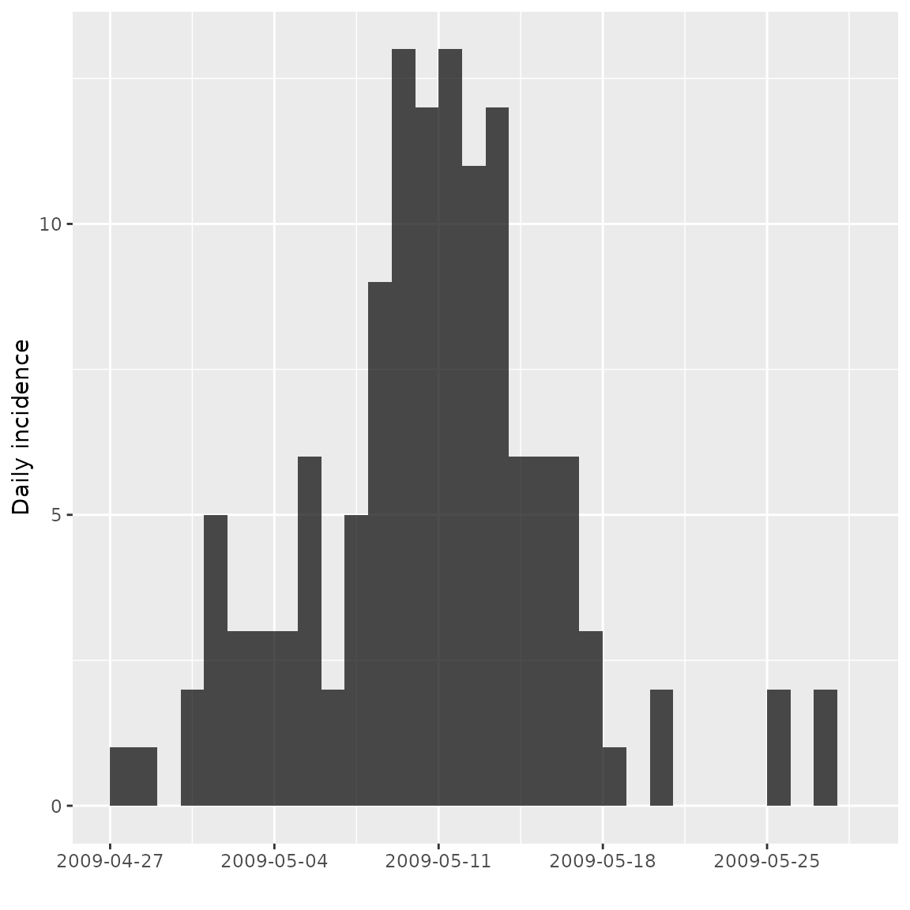

We can run `estimate_R` on the incidence data to estimate the
reproduction number R. For this, we need to specify i) the time
window(s) over which to estimate R and ii) information on the
distribution of the serial interval.

For i), the default behavior is to estimate R over weekly sliding
windows. This can be changed through the `config$t_start` and
`config$t_end` arguments (see below, “Changing the time windows for
estimation”).

For ii), there are several options, specified in the `method` argument.
All options assume that the serial interval is strictly positive. The
simplest option is the `parametric_si` method, where you only specify
the mean and standard deviation of the SI.

## Estimating R on sliding weekly windows, with a parametric serial interval

In this example, we only specify the mean and standard deviation of the
serial interval. In that case an offset gamma distribution is used for
the serial interval (the offset ensuring the serial interval is \>0). In
the following example, we use the mean and standard deviation of the
serial interval for flu from Ferguson et al., Nature, 2005:

``` r

res_parametric_si <- estimate_R(Flu2009$incidence, 
                                method="parametric_si",
                                config = make_config(list(
                                  mean_si = 2.6, 
                                  std_si = 1.5))
)
#> Default config will estimate R on weekly sliding windows.
#>     To change this change the t_start and t_end arguments.

head(res_parametric_si$R)
#>   t_start t_end date_start   date_end  Mean(R)    Std(R) Quantile.0.025(R)
#> 1       2     8 2009-04-28 2009-05-04 1.735798 0.4091314         1.0287437
#> 2       3     9 2009-04-29 2009-05-05 1.749168 0.3647267         1.1088223
#> 3       4    10 2009-04-30 2009-05-06 1.537058 0.3074116         0.9947030
#> 4       5    11 2009-05-01 2009-05-07 1.431839 0.2705921         0.9514466
#> 5       6    12 2009-05-02 2009-05-08 1.422725 0.2515046         0.9731426
#> 6       7    13 2009-05-03 2009-05-09 1.635373 0.2523436         1.1786332
#>   Quantile.0.05(R) Quantile.0.25(R) Median(R) Quantile.0.75(R) Quantile.0.95(R)
#> 1         1.121933         1.445198  1.703761         1.991520         2.458972
#> 2         1.195480         1.491345  1.723884         1.979457         2.389121
#> 3         1.068694         1.320090  1.516613         1.731761         2.075176
#> 4         1.017661         1.241251  1.414830         1.603900         1.904047
#> 5         1.035808         1.245996  1.407932         1.583340         1.860107
#> 6         1.243590         1.458847  1.622413         1.797779         2.071372
#>   Quantile.0.975(R)
#> 1          2.624781
#> 2          2.533119
#> 3          2.195540
#> 4          2.008849
#> 5          1.956336
#> 6          2.165745
```

The output of the estimate_r function is a list containing a number of
elements, the most important of which is `R`, a data.frame containing
details on the estimated reproduction number. Each line corresponds to
one time window.

The output can be plotted as follows:

``` r

plot(res_parametric_si, legend = FALSE)
#> Warning: The `size` argument of `element_line()` is deprecated as of ggplot2 3.4.0.
#> ℹ Please use the `linewidth` argument instead.
#> ℹ The deprecated feature was likely used in the EpiEstim package.
#>   Please report the issue at <https://github.com/mrc-ide/EpiEstim/issues>.
#> This warning is displayed once per session.
#> Call `lifecycle::last_lifecycle_warnings()` to see where this warning was
#> generated.
```

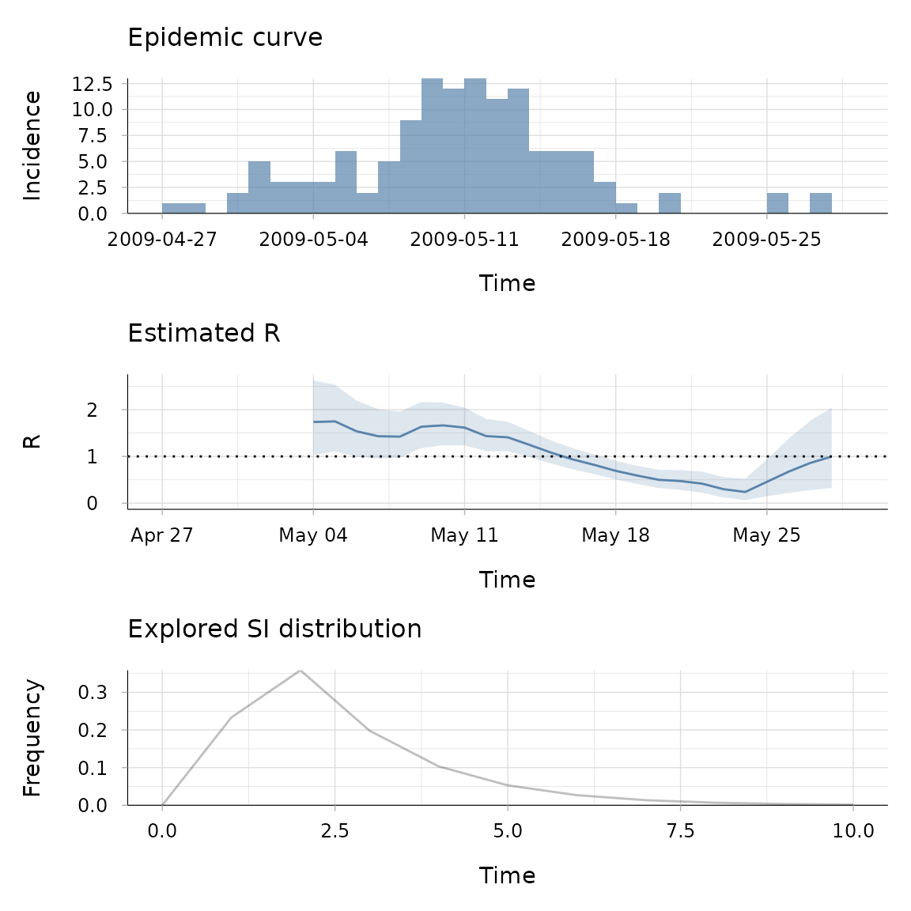

``` r

# use `type = "R"`, `type = "incid"` or `type = "SI"` 
# to generate only one of the 3 plots
```

This produces three graphs showing the incidence time series, the
estimated reproduction number (posterior mean and 95\\ credible
interval, with estimates for a time window plotted at the end of the
time window) and the discrete distribution of the serial interval.

## Estimating R with a non parametric serial interval distribution

If one already has a full distribution of the serial interval, and not
only a mean and standard deviation, this can be fed into `estimate_r` as
demonstrated below. Note that the serial interval distribution provided
must have a probability mass of zero for the first time step, ensuring
the SI is \>0.

``` r

res_non_parametric_si <- estimate_R(Flu2009$incidence, 
                                    method="non_parametric_si",
                                    config = make_config(list(
                                      si_distr = Flu2009$si_distr))
)
#> Default config will estimate R on weekly sliding windows.
#>     To change this change the t_start and t_end arguments.
# si_distr gives the probability mass function (PMF) of the serial interval for 
# time intervals 0, 1, 2, etc.
# the first value of the PMF must be zero, ensuring the SI is >0.
plot(res_non_parametric_si, "R")
```


Note that you can obtain such a full distribution of the serial interval
using `discr_si` function (this is how `Flu2009$si_distr` was obtained,
with additional rounding). The discretisation method implemented in
`discr_si` is documented in the supplementary material of Cori et
al. AJE 2013. It assumes a Gamma distributed serial interval, and
accounts for the fact that the serial interval is double-censored, i.e. 
the time of symptom onset in both the primary and secondary cases are
discrete (typically with a daily interval).

``` r

discr_si(0:20, mu = 2.6, sigma = 1.5)
#>  [1] 0.000000e+00 2.331721e-01 3.585794e-01 1.981108e-01 1.033427e-01
#>  [6] 5.290518e-02 2.682146e-02 1.351620e-02 6.783438e-03 3.394351e-03
#> [11] 1.694674e-03 8.445945e-04 4.203313e-04 2.089422e-04 1.037609e-04
#> [16] 5.148480e-05 2.552773e-05 1.264952e-05 6.264667e-06 3.101068e-06
#> [21] 1.534394e-06
```

## Estimating R accounting for uncertainty on the serial interval distribution

Sometimes, especially early in outbreaks, the serial interval
distribution can be poorly specified. Therefore `estimate_R` also allows
integrating results over various distributions of the serial interval.
To do so, the mean and sd of the serial interval are each drawn from
truncated normal distributions, with parameters specified by the user,
as in the example below:

``` r

## we choose to draw:
## - the mean of the SI in a Normal(2.6, 1), truncated at 1 and 4.2
## - the sd of the SI in a Normal(1.5, 0.5), truncated at 0.5 and 2.5
config <- make_config(list(mean_si = 2.6, std_mean_si = 1,
                           min_mean_si = 1, max_mean_si = 4.2,
                           std_si = 1.5, std_std_si = 0.5,
                           min_std_si = 0.5, max_std_si = 2.5))
res_uncertain_si <- estimate_R(Flu2009$incidence,
                               method = "uncertain_si",
                               config = config)
#> Default config will estimate R on weekly sliding windows.
#>     To change this change the t_start and t_end arguments.
plot(res_uncertain_si, legend = FALSE) 
```

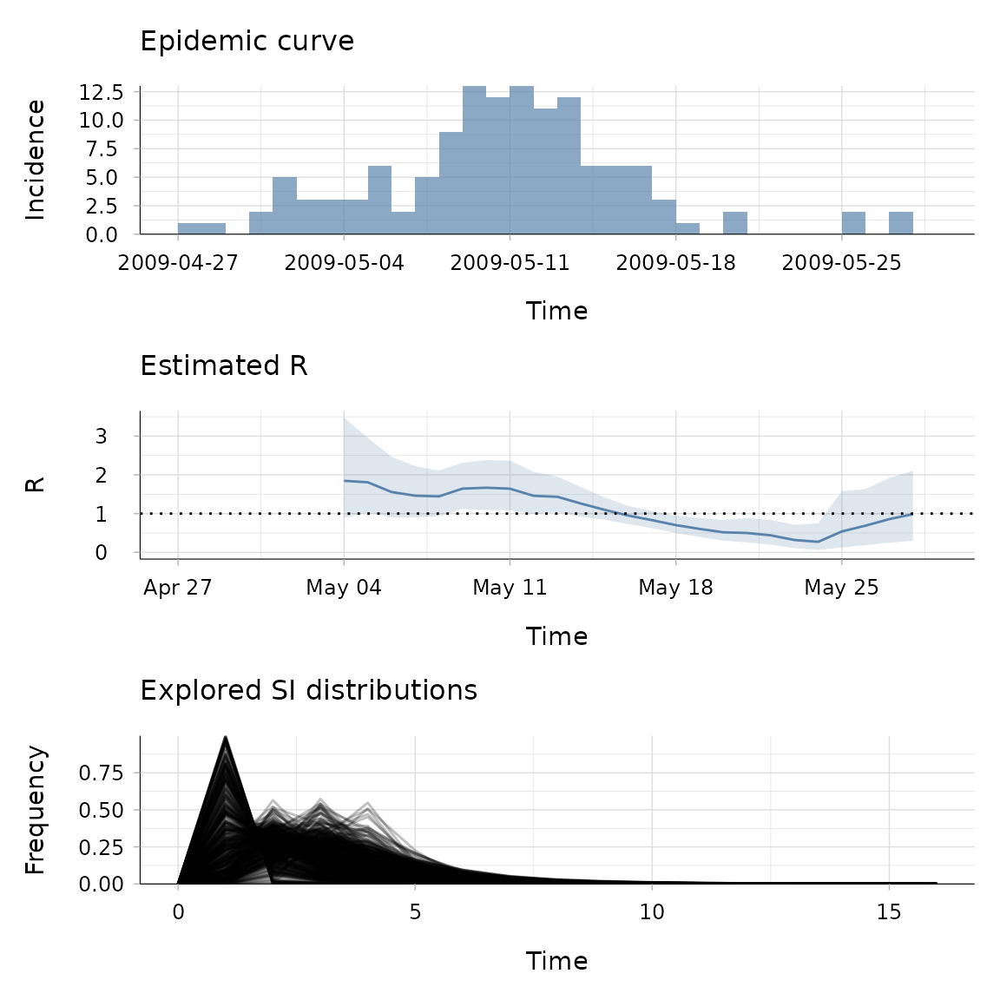

``` r

## the third plot now shows all the SI distributions considered
```

Note that the results above are obtained numerically and thus can be
slower to compute. You can adjust the parameters governing the sample
sizes by altering the default values of `config$n1` and `config$n2`
(`n1` is the number of pairs of mean and sd of the SI that are drawn and
`n2` is the size of the posterior sample drawn for each pair of mean, sd
of SI).

## Estimating R and the serial interval using data on pairs infector/infected

Usually, the serial interval distribution is estimated using data on the
date of symptoms onset in pairs of infectors / infected individuals. The
serial interval distribution estimate is then fed into reproduction
number estimates. Typically, a single SI distribution is used to
estimate the reproduction number throughout an outbreak.

This approach doesn’t account for uncertainty in the serial interval
distribution, and doesn’t allow to incorporate data collected later in
the outbreak which could inform the serial interval distribution.

In `estimate_R`, we now allow the serial interval distribution to be
directly estimated, using MCMC, from interval censored exposure data.
The reproduction number is then estimated using the posterior
distribution of the SI, hence accounting for the uncertainty associated
with this estimate.

As the epidemic progresses, newly collected exposure data can be
incorporated to update the serial interval estimate.

This method is new to `EpiEstim` and described in a manuscript in
preparation (Thompson et al.).

The `Flu2009` dataset contains interval-censored serial interval data
from the 2009 outbreak of H1N1 influenza in San Antonio, Texas, USA
(from Morgan et al., EID 2010).

``` r

## interval-ceonsored serial interval data:
## each line represents a transmission event, 
## EL/ER show the lower/upper bound of the symptoms onset date in the infector
## SL/SR show the same for the secondary case
## type has entries 0 corresponding to doubly interval-censored data
## (see Reich et al. Statist. Med. 2009).
head(Flu2009$si_data)
#>   EL ER SL SR type
#> 1  0  1  7  8    0
#> 2  0  1  2  3    0
#> 3  0  1  3  4    0
#> 4  0  1  2  5    0
#> 5  0  1  1  9    0
#> 6  0  1  2  4    0
```

These can be used to estimate the SI within `estimate_R`, and produce
estimates of the reproduction number based on the full SI posterior
distribution:

``` r

## fixing the random seeds
MCMC_seed <- 1
overall_seed <- 2
mcmc_control <- make_mcmc_control(seed = MCMC_seed, 
                                  burnin = 1000)
dist <- "G" # fitting a Gamma dsitribution for the SI
config <- make_config(list(si_parametric_distr = dist,
                           mcmc_control = mcmc_control,
                           seed = overall_seed, 
                           n1 = 50, 
                           n2 = 50))
res_si_from_data <- estimate_R(Flu2009$incidence,
                               method = "si_from_data",
                               si_data = Flu2009$si_data,
                               config = config)
#> Default config will estimate R on weekly sliding windows.
#>     To change this change the t_start and t_end arguments.
#> Warning in si_from_data_valid_distrs(config$si_parametric_distr): The distribution names 'G', 'W', 'L', 'off1G', 'off1W', and
#>             'off1L' are deprecated. Please use the more descriptive names gamma instead.The distribution names 'G', 'W', 'L', 'off1G', 'off1W', and
#>             'off1L' are deprecated. Please use the more descriptive names weibull instead.The distribution names 'G', 'W', 'L', 'off1G', 'off1W', and
#>             'off1L' are deprecated. Please use the more descriptive names lognormal instead.The distribution names 'G', 'W', 'L', 'off1G', 'off1W', and
#>             'off1L' are deprecated. Please use the more descriptive names gamma_offset_1 instead.The distribution names 'G', 'W', 'L', 'off1G', 'off1W', and
#>             'off1L' are deprecated. Please use the more descriptive names weibull_offset_1 instead.The distribution names 'G', 'W', 'L', 'off1G', 'off1W', and
#>             'off1L' are deprecated. Please use the more descriptive names lognormal_offset_1 instead.
#> Warning in si_from_data_valid_distrs(dist): The distribution names 'G', 'W', 'L', 'off1G', 'off1W', and
#>             'off1L' are deprecated. Please use the more descriptive names gamma instead.The distribution names 'G', 'W', 'L', 'off1G', 'off1W', and
#>             'off1L' are deprecated. Please use the more descriptive names weibull instead.The distribution names 'G', 'W', 'L', 'off1G', 'off1W', and
#>             'off1L' are deprecated. Please use the more descriptive names lognormal instead.The distribution names 'G', 'W', 'L', 'off1G', 'off1W', and
#>             'off1L' are deprecated. Please use the more descriptive names gamma_offset_1 instead.The distribution names 'G', 'W', 'L', 'off1G', 'off1W', and
#>             'off1L' are deprecated. Please use the more descriptive names weibull_offset_1 instead.The distribution names 'G', 'W', 'L', 'off1G', 'off1W', and
#>             'off1L' are deprecated. Please use the more descriptive names lognormal_offset_1 instead.
#> Running 1500 MCMC iterations 
#> MCMCmetrop1R iteration 1 of 1500 
#> function value =  -27.68336
#> theta = 
#>    1.67335
#>   -0.27928
#> Metropolis acceptance rate = 0.00000
#> 
#> MCMCmetrop1R iteration 1001 of 1500 
#> function value =  -29.17093
#> theta = 
#>    1.07173
#>    0.18715
#> Metropolis acceptance rate = 0.54246
#> 
#> 
#> 
#> @@@@@@@@@@@@@@@@@@@@@@@@@@@@@@@@@@@@@@@@@@@@@@@@@@@@@@@@@
#> The Metropolis acceptance rate was 0.55267
#> @@@@@@@@@@@@@@@@@@@@@@@@@@@@@@@@@@@@@@@@@@@@@@@@@@@@@@@@@
#> Warning in estimate_R(Flu2009$incidence, method = "si_from_data", si_data =
#> Flu2009$si_data, : Our serial interval estimation method does not correct for
#> right censoring. It may yield biased results when applied to right-censored
#> infector/infected pairs, such as those observed during an ongoing outbreak. See
#> Charniga et al. (PLoS Comp Biol, 2024) and consider using the R package
#> primarycensored for real-time serial interval estimation.
#> 
#> Gelman-Rubin MCMC convergence diagnostic was successful.
#> 
#> @@@@@@@@@@@@@@@@@@@@@@@@@@@@@@@@@@@@@@@@@@@@@@@@@@@@@@@@@ 
#> Estimating the reproduction number for these serial interval estimates...
#>  @@@@@@@@@@@@@@@@@@@@@@@@@@@@@@@@@@@@@@@@@@@@@@@@@@@@@@@@@

plot(res_si_from_data, legend = FALSE)
```

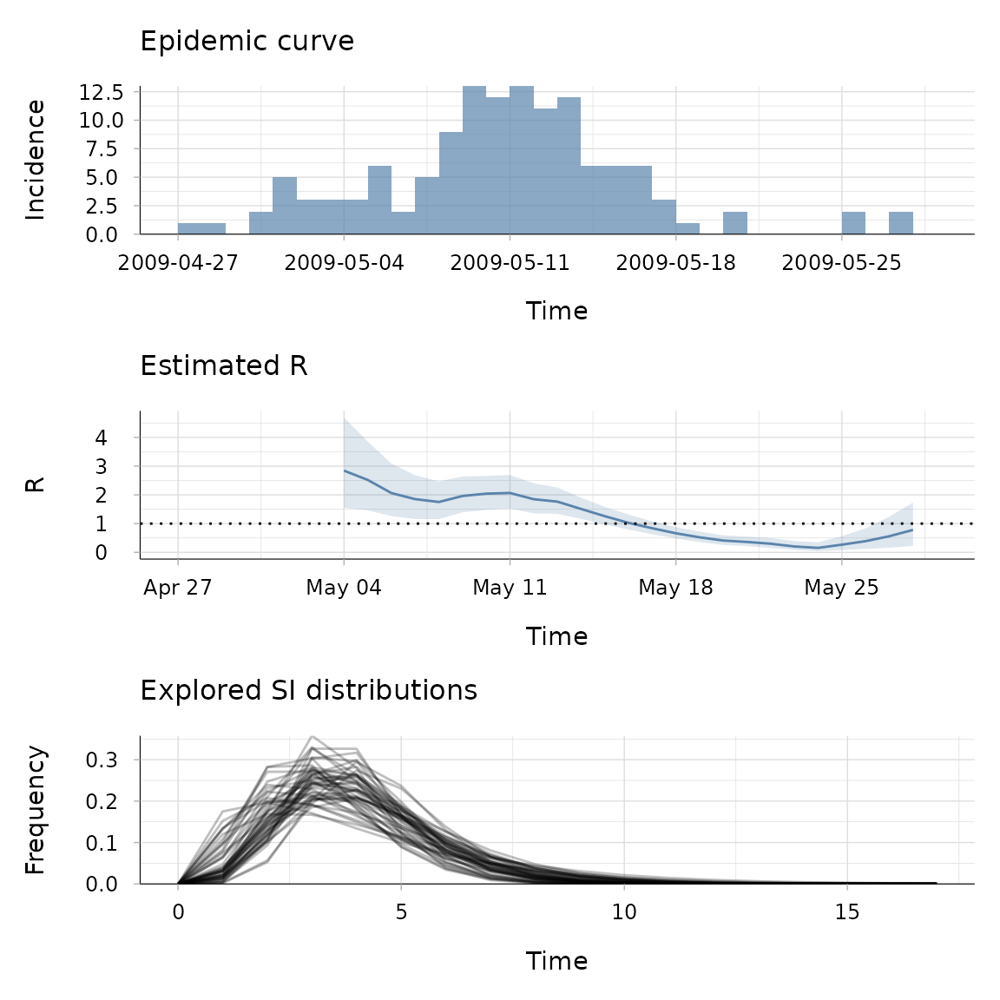

``` r

## the third plot now shows the posterior sample of SI distributions 
## that were integrated over
```

Now say you want to save your estimates of the serial interval first,
and then use them within `estimate_R`. This can be useful e.g. if you
want to explore several time windows for R estimation, but based on the
same SI data, and so you don’t want to run the MCMC to estimate the SI
within `estimate_R` every time. You can do this as follow:

``` r

## using the same random seeds as before to be able to compare results

## first estimate the SI distribution using function dic.fit.mcmc fron 
## coarseDataTools package:
n_mcmc_samples <- config$n1*mcmc_control$thin
dist <- "G"
dist_nice_name <- "gamma"
SI_fit <- coarseDataTools::dic.fit.mcmc(dat = Flu2009$si_data,
                  dist = dist,
                  init.pars = init_mcmc_params(Flu2009$si_data, dist_nice_name),
                  burnin = mcmc_control$burnin,
                  n.samples = n_mcmc_samples,
                  seed = mcmc_control$seed)
#> Running 1500 MCMC iterations 
#> MCMCmetrop1R iteration 1 of 1500 
#> function value =  -27.68336
#> theta = 
#>    1.67335
#>   -0.27928
#> Metropolis acceptance rate = 0.00000
#> 
#> MCMCmetrop1R iteration 1001 of 1500 
#> function value =  -29.17093
#> theta = 
#>    1.07173
#>    0.18715
#> Metropolis acceptance rate = 0.54246
#> 
#> 
#> 
#> @@@@@@@@@@@@@@@@@@@@@@@@@@@@@@@@@@@@@@@@@@@@@@@@@@@@@@@@@
#> The Metropolis acceptance rate was 0.55267
#> @@@@@@@@@@@@@@@@@@@@@@@@@@@@@@@@@@@@@@@@@@@@@@@@@@@@@@@@@
## thinning the output of the MCMC and converting using coarse2estim function
si_sample <- coarse2estim(SI_fit, thin = mcmc_control$thin)$si_sample
res_si_from_sample <- estimate_R(Flu2009$incidence,
                                method = "si_from_sample",
                                si_sample = si_sample,
                                config = make_config(list(n2 = 50, 
                                seed = overall_seed)))
#> Default config will estimate R on weekly sliding windows.
#>     To change this change the t_start and t_end arguments.

## check that res_si_from_sample is the same as res_si_from_data
## since they were generated using the same MCMC algorithm to generate the SI
## sample (either internally to EpiEstim or externally)
all(res_si_from_sample$R$`Mean(R)` == res_si_from_data$R$`Mean(R)`)
#> [1] TRUE
```

## Changing the time windows for estimation

The time window can be specified through arguments `config$t_start` and
`config$t_end`. For instance, the default weekly sliding windows can
also be obtained by specifying:

``` r

T <- nrow(Flu2009$incidence)
t_start <- seq(2, T-6) # starting at 2 as conditional on the past observations
t_end <- t_start + 6 # adding 6 to get 7-day windows as bounds included in window
res_weekly <- estimate_R(Flu2009$incidence, 
                         method="parametric_si",
                         config = make_config(list(
                           t_start = t_start,
                           t_end = t_end,
                           mean_si = 2.6, 
                           std_si = 1.5))
)
plot(res_weekly, "R") 
```

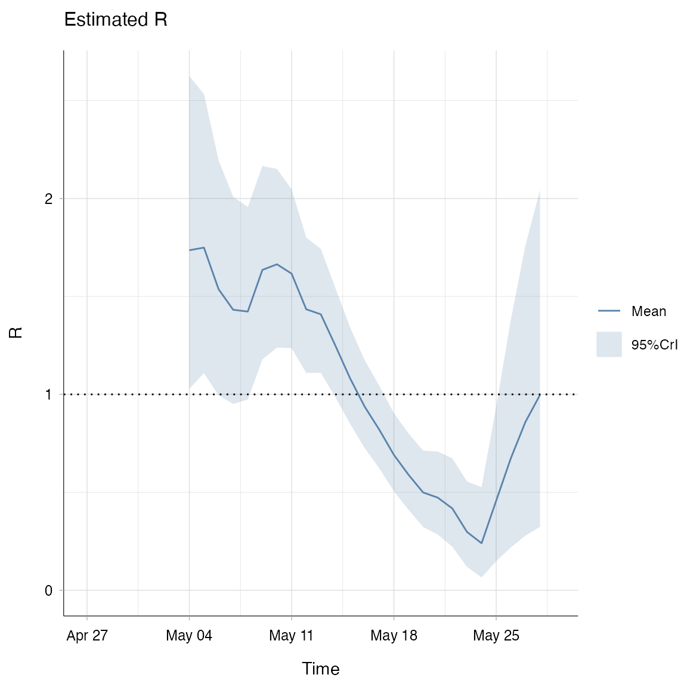

For biweekly estimates:

``` r

t_start <- seq(2, T-13) # starting at 2 as conditional on the past observations
t_end <- t_start + 13 
res_biweekly <- estimate_R(Flu2009$incidence, 
                           method="parametric_si",
                           config = make_config(list(
                             t_start = t_start,
                             t_end = t_end,
                             mean_si = 2.6, 
                             std_si = 1.5))
)
plot(res_biweekly, "R") 
```

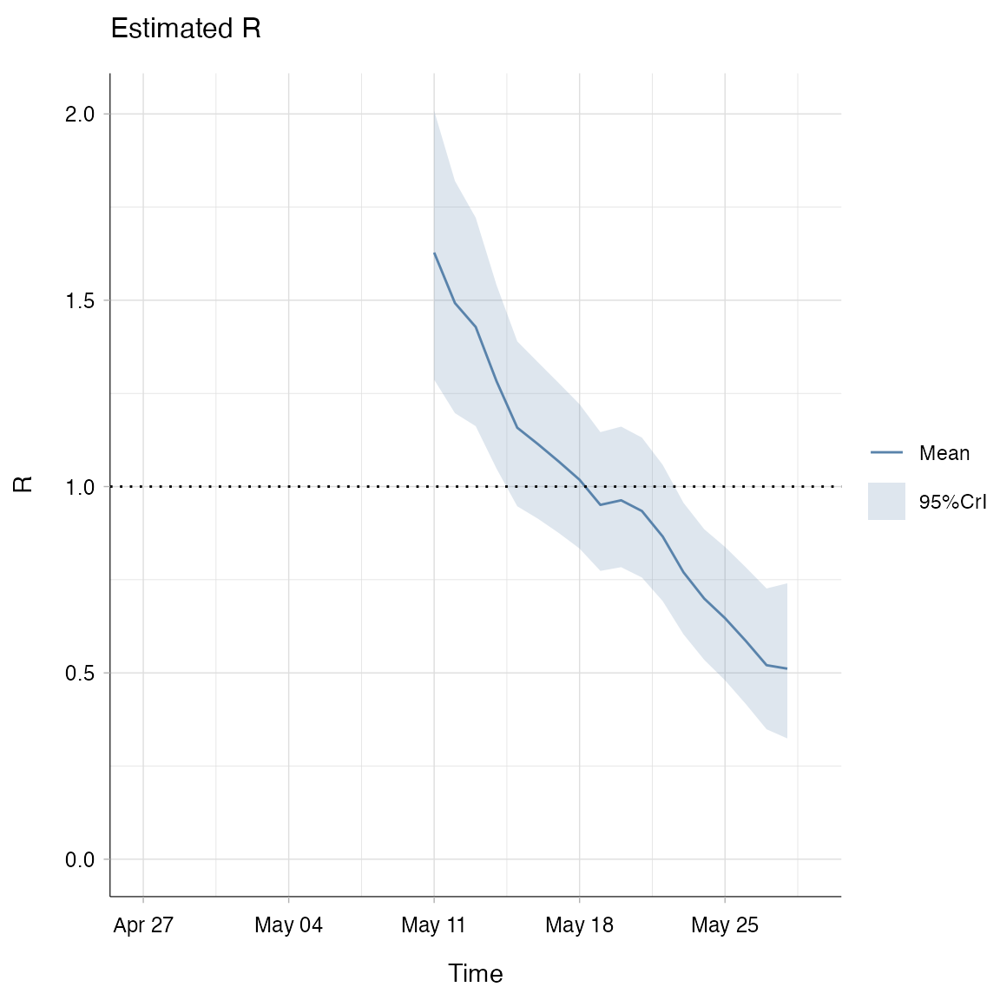

So far we have used estimates on sliding windows. Sometimes it may be
useful to consider consecutive non overlapping windows as well. For
instance, in the flu outbreak we are considering, the school closed from
14th to 20th May 2009, i.e. days 18 to 24 in our dataset (Cauchemez et
al., PNAS, 2011). It is interesting to estimate the reproduction number
before, during, and after the school closure to assess whether this had
an impact on transmissibility.

``` r

t_start <- c(2, 18, 25) # starting at 2 as conditional on the past observations
t_end <- c(17, 24, 32)
res_before_during_after_closure <- estimate_R(Flu2009$incidence, 
                                              method="parametric_si",
                                              config = make_config(list(
                                                t_start = t_start,
                                                t_end = t_end,
                                                mean_si = 2.6, 
                                                std_si = 1.5))
)
plot(res_before_during_after_closure, "R") +
  geom_hline(aes(yintercept = 1), color = "red", lty = 2)
```

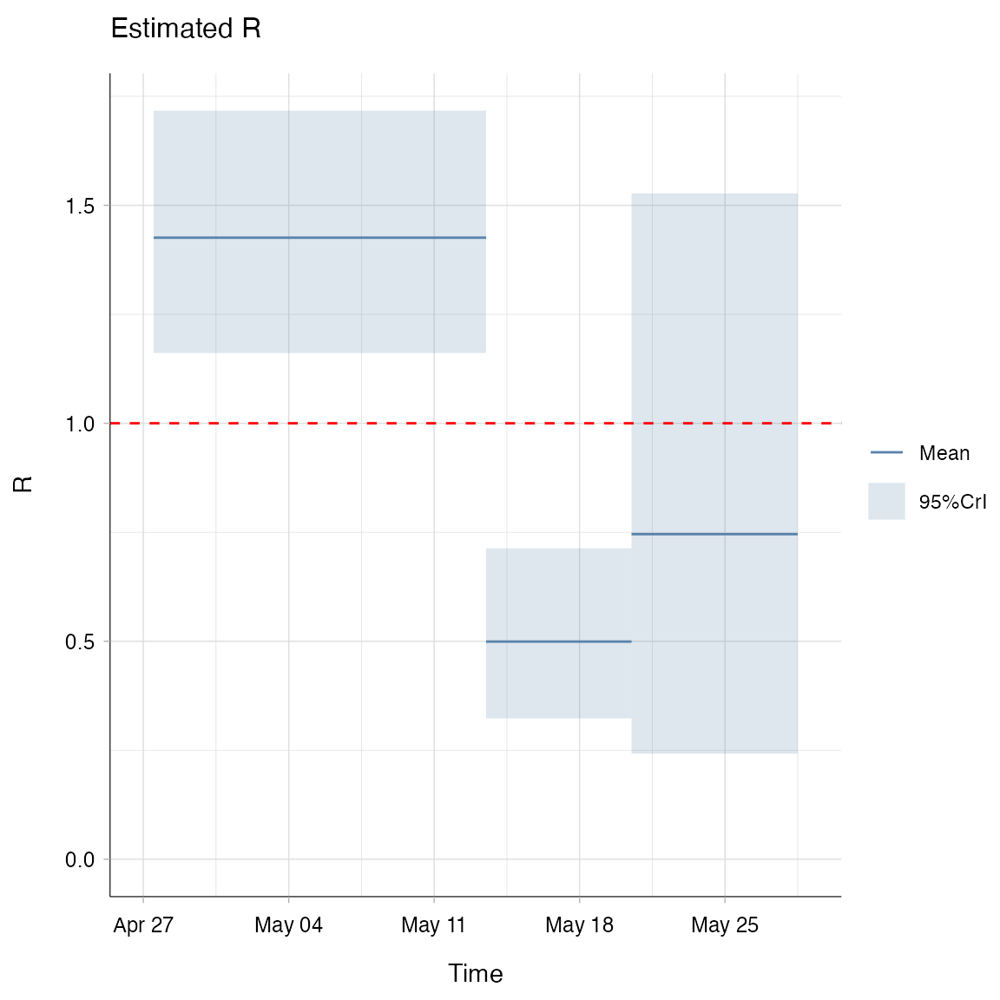

The results above suggest that the school closure was effective in terms
of reducing transmissibility, as the estimated reproduction number
during the school closure was significantly lower than that before
closure, and was estimated to be under the threshold value 1.

## Accounting for missed generations of infections

A common source of bias for early estimates of the reproduction number
is the inability to account for the existence of infections that
preceded the first reported case (as observed by [O’Driscoll et
al. (2021)](https://doi.org/10.1093/cid/ciaa1599)). A simple solution,
outlined in [Brizzi, O’Driscoll, and Dorigatti
(2022)](https://doi.org/10.1093/cid/ciac138), consists in using early
incidence to impute the number of past, unobserved infections prior to
estimating the reproduction number. To use this method, specify the
`backimputation_window` argument in `estimate_R` to an integer. This
specifies the length of the observation window used for backimputation.

``` r

res_backimputation <- estimate_R(Flu2009$incidence$I, 
                                method="parametric_si",
                                config = make_config(list(
                                  mean_si = 2.6, 
                                  std_si = 1.5)),
                                backimputation_window = 7)
#> Default config will estimate R on weekly sliding windows.
#>     To change this change the t_start and t_end arguments.
plot(res_backimputation, "R")
```

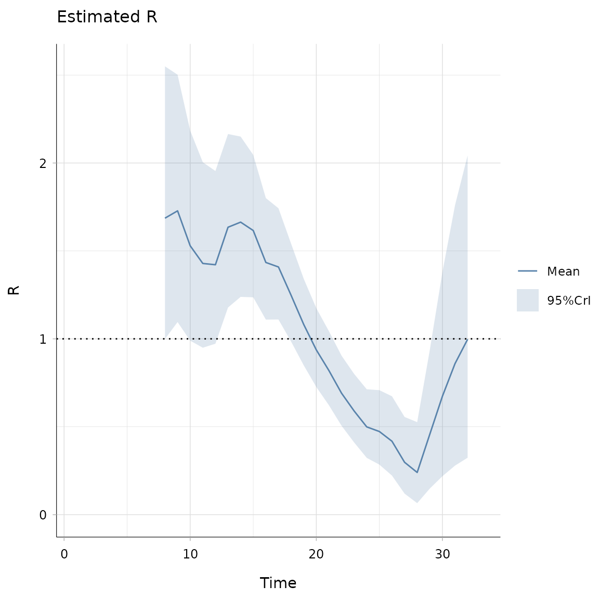

Here, the first $`R_t`$ estimates obtained with back-imputation
(1.6862334) closely match those obtained without back-imputation
(1.7357977) stored in `res_parametric_si`. In this case, this suggests
that the $`R_t`$ estimates are are robust to the existence of unobserved
cases. However, in other scenarios, the difference between the two
estimates can be substantial. The back-imputation method can then be
used to avoid misleading conclusions based on early data. For more
examples, refer to the
[vignette](https://mrc-ide.github.io/EpiEstim/articles/EpiEstim_backimputation.md)

## Different ways of specifying the incidence

So far we have specified the `incid` argument using a table with two
columns indicating the dates and the number of incident cases for each
date.

`estimate_R` accepts a range of formats for its `incid` argument.

This can be a table, as we’ve seen. In that case there needs to be a
column called `I` containing the number of incident cases. If a column
`dates` is present it is used in the x-axes when producing plots:

``` r

head(Flu2009$incidence)
#>        dates I
#> 1 2009-04-27 1
#> 2 2009-04-28 1
#> 3 2009-04-29 0
#> 4 2009-04-30 2
#> 5 2009-05-01 5
#> 6 2009-05-02 3
config <- make_config(list(mean_si = 2.6, std_si = 1.5))
res_incid_table <- estimate_R(Flu2009$incidence, 
                              method="parametric_si",
                              config = config)
#> Default config will estimate R on weekly sliding windows.
#>     To change this change the t_start and t_end arguments.
plot(res_incid_table, "R")
```


It can just be a vector (but then the x-axis in your plots is measured
in time steps since start of the outbreak)

``` r

res_incid_vector <- estimate_R(Flu2009$incidence$I, 
                               method="parametric_si",
                               config = config)
#> Default config will estimate R on weekly sliding windows.
#>     To change this change the t_start and t_end arguments.
plot(res_incid_vector, "R")
```

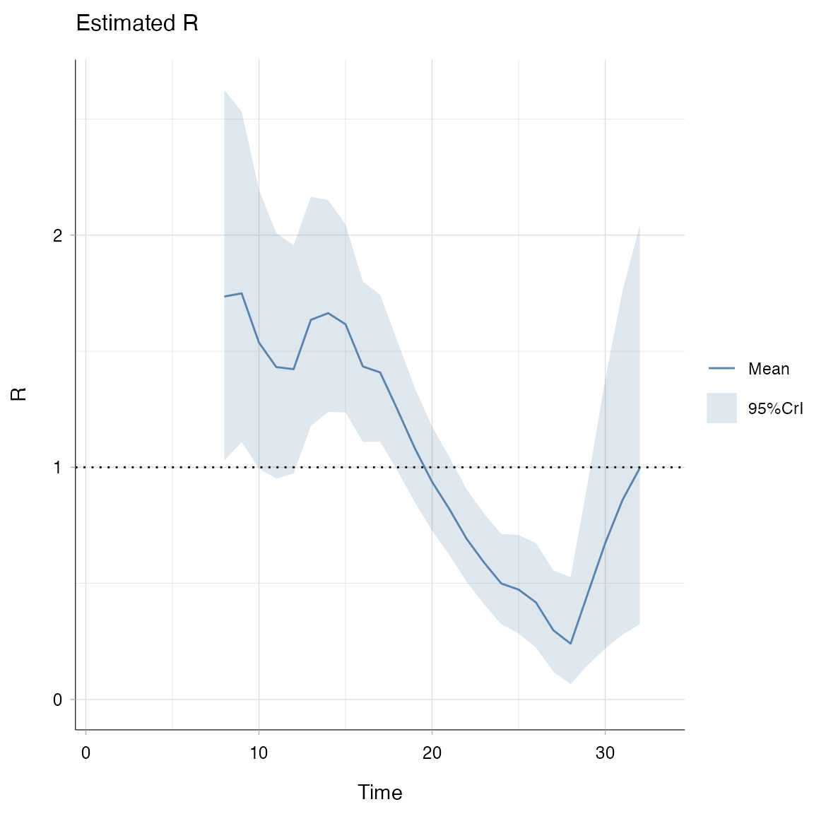

Finally, `incid` can be an object of the class `incidence`, as created
for instance by the function `incidence` of the `incidence` package.

Let’s artificially create a line-list corresponding to our flu incidence
data:

``` r

dates_onset <- Flu2009$incidence$dates[unlist(lapply(seq_len(nrow(Flu2009$incidence)), function(i) 
  rep(i, Flu2009$incidence$I[i])))]
```

and now use the `incidence` function to generate an object that we feed
to `estimate_R`:

``` r

last_date <- Flu2009$incidence$date[T]
res_incid_class <- estimate_R(incidence(dates_onset, last_date = last_date), 
                              method="parametric_si",
                              config = config)
#> Default config will estimate R on weekly sliding windows.
#>     To change this change the t_start and t_end arguments.
plot(res_incid_class, "R")
```


## Specifying imported cases

All of the above assumes that all cases are linked by local
transmission. Sometimes you may have information (from field
epidemiological investigations for instance) indicating that some cases
are in fact imported (from another location, or from an animal
reservoir). We allow to include such information, when available, as
illustrated in the example below:

``` r

# generating fake information on our cases:
location <- sample(c("local","imported"), length(dates_onset), replace=TRUE)
location[1] <- "imported" # forcing the first case to be imported

## get incidence per group (location)
incid <- incidence(dates_onset, groups = location)

plot(incid)
```

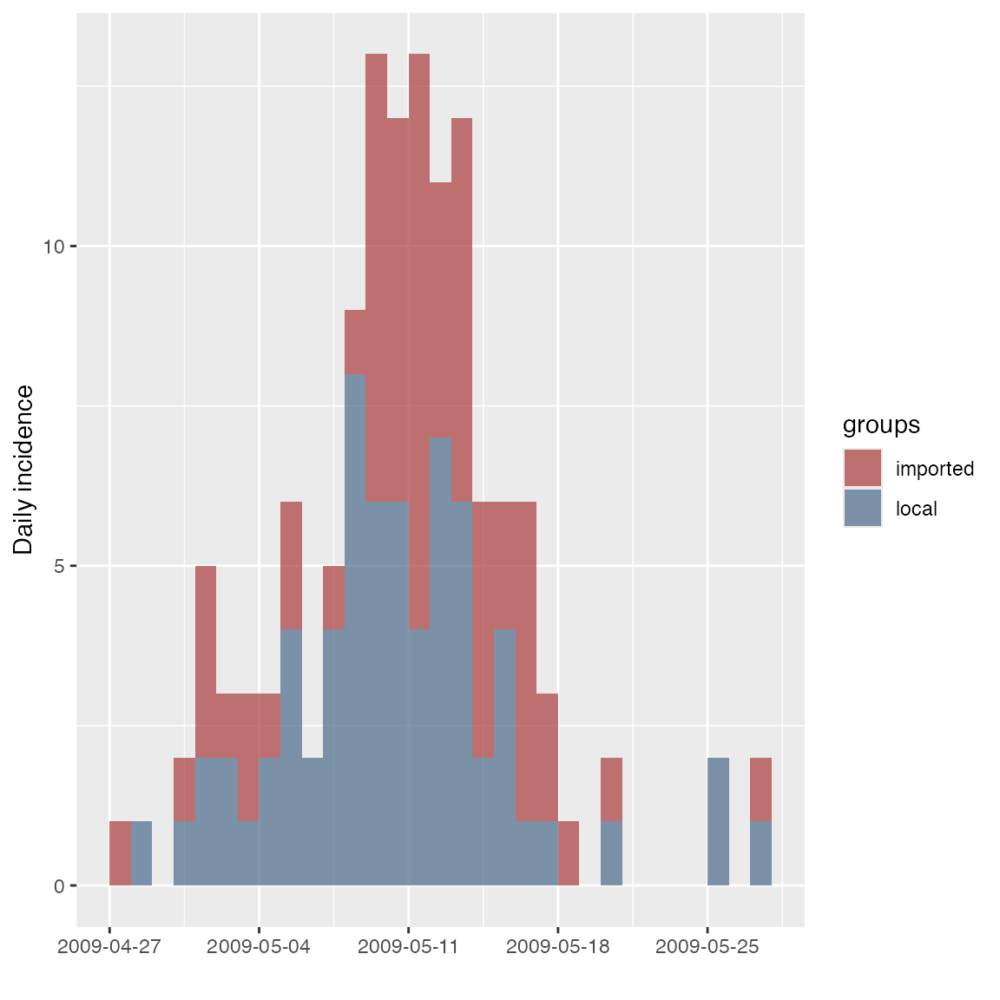

``` r


## Estimate R with assumptions on serial interval
res_with_imports <- estimate_R(incid, method = "parametric_si",
                   config = make_config(list(
                   mean_si = 2.6, std_si = 1.5)))
#> Default config will estimate R on weekly sliding windows.
#>     To change this change the t_start and t_end arguments.
plot(res_with_imports, add_imported_cases=TRUE)
#> The number of colors (1) did not match the number of groups (2).
#> Using `col_pal` instead.
```

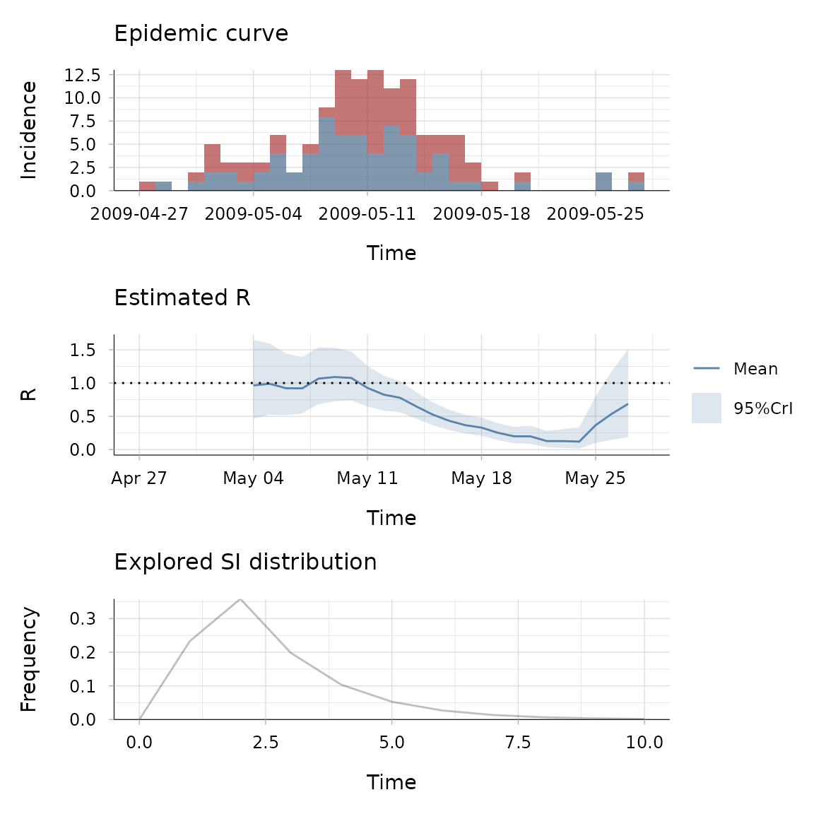

Note that in the above the estimated reproduction number is, as
expected, much lower than estimated before when assuming that all cases
were linked by local transmission.

This feature is new to `EpiEstim` and described in a manuscript in
preparation (Thompson et al.).

## EpiEstimApp

We have a shiny app which integrates some of the core features presented
above <https://github.com/jstockwin/EpiEstimApp>. Please note the app
does not have all features from the R package.
