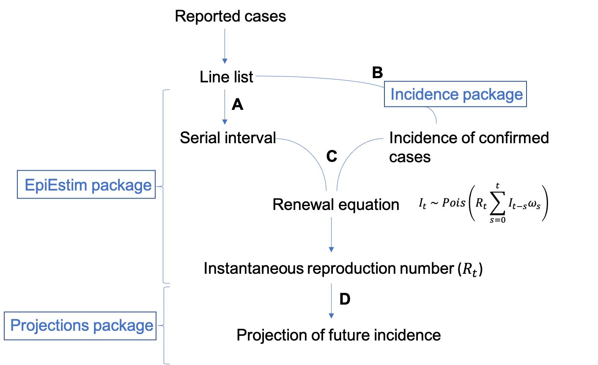
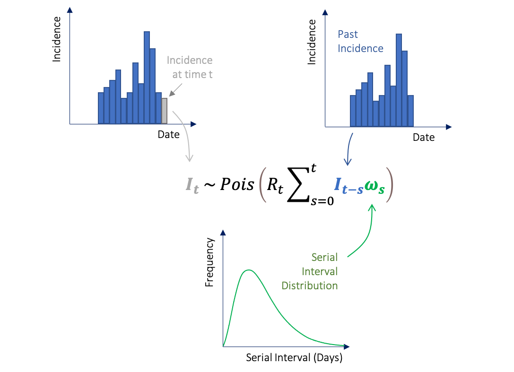

```{r setup, include = FALSE}
knitr::opts_chunk$set(
  collapse = TRUE,
  comment = "#>"
)
require(kableExtra)
require(hrbrthemes)
require(gghighlight)
require(MCMCglmm)
require(projections)
require(EpiEstim) 
require(ggplot2)
require(incidence)
require(dplyr)
require(gridExtra)
```

The `EpiEstim` package allows you to estimate the time varying reproduction number (R~t~) from epidemic data. This vignette will take you through the key stages in the process of estimating R~t~ and also introduce some additional packages (`incidence` and `projections`) that can work alongside EpiEstim in a typical outbreak analysis workflow. Please also see the 'Examples' and 'FAQs' sections.

<div style="margin-top:30px;">
# Overview
</div>

```{r, echo=FALSE, out.width="90%"}

```


## Input data

The standard way that outbreak data is presented is in the form of a linelist, which incorporates detailed information on the reported cases of an outbreak. For example:


```{r, echo=FALSE}
Case_ID <- c(1,2,3,4,"...")
Date_rep <- c("dd/mm/yy","dd/mm/yy","dd/mm/yy","dd/mm/yy","...")
Date_onset <- c("dd/mm/yy","dd/mm/yy","dd/mm/yy","dd/mm/yy","...")
Date_exp <- c("dd/mm/yy","dd/mm/yy","dd/mm/yy","dd/mm/yy","...")
MF <- c("F","M","M","F","...")
Age <- c(26,32,41,68,"...")
Outcome <- c("recovered","died","recovered","recovered","...")
Classification <- c("confirmed","suspected","confirmed","probable","...")
df <- data.frame(Case_ID,Date_rep,Date_onset, Date_exp, MF, Age, Outcome,Classification)
knitr::kable(df, col.names = c("Case ID","Date Reported","Date Symptom Onset","Date Exposure","M/F","Age","Outcome","Classification"))
```

In order to estimate R~t~, EpiEstim needs to be supplied with an estimate of the serial interval distribution (**step A**) and the incidence of confirmed cases (**step B**). 

###Step A: Serial Interval

The serial interval is the time between symptom onset in successive cases. The serial interval distribution can be parameterised either by estimates taken from the literature or it can be estimated directly from the linelist if you have data for infector-infected pairs.

**Serial interval from the literature:**

If a disease has been well characterised, then you have the option to use estimates of the serial interval that can be found in the literature. You can either supply the mean and standard deviation (parametric distribution) or the full distribution (non-parametric distribution). See examples A and B in the Examples section. 

**Serial interval from infector-infected pairs:**

This feature was recently incorporated into EpiEstim by Thompson et al 2019. If you have data for infector-infected pairs of cases you can estimate the serial interval distribution directly from your own data and account for its uncertainty. 

<div style="margin-top:20px;">
<div style="margin-bottom:20px;">
```{r, echo=FALSE, out.width="90%"}
knitr::include_graphics("./figs/Serial interval with uncertainty.png")
```
</div>
</div>

For example, if "Case ID" represents the person who has been exposed and infected and "Infector ID" represents the potential source of infection, then you can format the contact data as follows:


```{r, echo=FALSE}
Case_ID <- c(299,302,341,389,"...")
Infector_ID <- c(208,272,301,312,"...")
Source_of_exposure <- c("funeral","hospital","household","other","...")
df <- data.frame(Case_ID,Infector_ID,Source_of_exposure)
knitr::kable(df, col.names = c("Case ID","Infector ID","Source of Exposure"))
```

Combined with dates of symptom onset in the line list, these can be used to estimate the serial interval distribution in this outbreak. 

In an ideal world we would have access to data in the format above, where dates of symptom onset for infector/infected individuals are very well defined, but often we do not know the exact date of symptom onset. In this situation, EpiEstim allows you to account for this uncertainty using "interval-censored data", where there are lower and upper bounds for the symptom onset time in infector/infected cases (Thompson et al 2019). 

<div style="margin-bottom:20px;">
<div style="margin-top:20px;">

```{r fig.align="center", echo=FALSE, out.width="40%"}
knitr::include_graphics("./figs/interval-censored example.png",
                        auto_pdf = getOption("knitr.graphics.auto_pdf", FALSE))
```
</div>
</div>

This type of data may look like this: 

```{r, echo=FALSE}
#Case_ID <- c(299,302,341,389,"...")
#Infector_ID <- c(208,272,301,312,"...")
Time_inf_symp_LB <- c("21","23","34","46","...")
Time_inf_symp_UB <- c("25","26","39","52","...")
Time_rec_symp_LB <- c("26","26","41","54","...")
Time_rec_symp_UB <- c("28","30","43","55","...")
df <- data.frame(Time_inf_symp_LB,Time_inf_symp_UB,Time_rec_symp_LB,Time_rec_symp_UB)
knitr::kable(df, "html",col.names = c("Day infector symptom onset (LB)","Day infector symptom onset (UB)","Day infected symptom onset (LB)","Day infected symptom onset (UB)"))
```


For an example of how we can parameterise the SI using this method, see example C in the Examples section.

It is important to note that, particularly for outbreaks of emerging diseases, the serial interval estimate can be updated when you gather more data as the epidemic progresses.

###Step B: Incidence

The package `incidence` can be used to easily plot incidence, as shown in the following example using a pre-loaded `EpiEstim` dataset of an Influenza outbreak in 2009 ("Flu2009").

```{r}
data("Flu2009") # load example dataset
head(Flu2009$incidence) # displays the first n rows of the Flu2009$incidence data 
```

For instance, in this example, incidence (I) is a count of individuals with a symptom onset on a particular date. We can plot this using `incidence` as follows:

```{r, warning=FALSE, fig.align="center",fig.width=5}
plot(as.incidence(Flu2009$incidence$I, dates = Flu2009$incidence$dates))
```

`incidence` can convert the dates of symptom onset from linelists with various formats into an incidence object that can be easily understood by `EpiEstim`.

Please see the `incidence` vignette overview for more details, features and examples: https://cran.r-project.org/web/packages/incidence/vignettes/overview.html

<div style="margin-top:20px;">
**Local and Imported cases:**
</div>
If you have data that distinguishes between local and imported cases, this can be supplied to EpiEstim with local and imported incidence in two separate columns, for example in this dataset:

```{r, echo=FALSE}
Date <- c("dd/mm/yy","dd/mm/yy","dd/mm/yy","dd/mm/yy","...")
Incid_overall <- c(31,48,45,52,"...")
Incid_local <- c(28,46,44,48,"...")
Incid_import <- c(3,2,1,4,"...")

df <- data.frame(Date,Incid_overall,Incid_local,Incid_import)
table2 <- knitr::kable(df, "html",col.names = c("Date","Incidence Overall","Incidence Local","Incidence Imported"))
column_spec(table2,1:4,width="5.5cm")
```

##Estimate R~t~

Once you have an incidence object (based on the dates of symptom onset) and information on the serial interval distribution, we can use the renewal equation (a form of branching process model) to estimate R~t~. R~t~ is the average number of secondary cases that an infected individual would infect if the conditions remained as they were at time t (Cori et al 2013). 


```{r, echo=FALSE, out.width="100%"}

```

Here I~t~ represents the incidence of symptom onset at time t, which is approximated by a Poisson process using the renewal equation. R~t~ is what we want to estimate, I~t-s~ is the past indidence and $\omega$ is the serial interval distribution.

###Step C: `estimate_R()`

This is where the `estimate_R()` function comes in. We supply `EpiEstim` with the incidence and tell the package which method we want to use to parameterise the serial interval.

```{r, eval=FALSE}
estimate_R(
  incid = incidence_object,
  method = c("parametric_si","non_parametric_si","si_from_data",
             "uncertain_si","si_from_sample"), # choose one e.g. method = "parametric_si"
  si_data = NULL, # if using "si_from_data" supply infector-infected data here
  si_sample = NULL, # if using "si_from_sample" supply matrix where each column is an SI to be explored
  config = make_config(list())
)
```

As mentioned, the serial interval (SI) can be defined using one of the following methods:

**Parametric** - `"parametric_si"` uses the mean and standard deviation. Ex. The user can supply `mean_si=3` and `std_si=1`, which generates an offset gamma distribution as the default:

```{r fig.align="center", echo=FALSE, out.width="30%"}
#ggdistribution(dnorm, seq(0, 8, 0.1), mean = 3, sd = 1)=
x_lower_norm <- 0
x_upper_norm <- 7
ggplot(data.frame(x = c(x_lower_norm , x_upper_norm)), aes(x = x)) + 
  xlim(c(x_lower_norm , x_upper_norm)) + 
  stat_function(fun = dgamma, args = list(shape = (3/1)^2, rate = 3/1^2)) + # mean = 3, sd = 1
  theme_ipsum()+
  theme(
    plot.margin = margin(t = 50, r = 20, b = 20, l = 20),
    axis.title.x = element_text(margin = margin(t=5,r=0,b=0,l=0), size=13),
    axis.title.y = element_text(margin = margin(t=0,r=10,b=0,l=0), size=13),
    panel.grid.minor.y = element_blank(),
    panel.grid.minor.x = element_blank(),
    panel.grid.major.y = element_blank(),
    panel.grid.major.x = element_blank(),
    axis.line.x = element_line(color="lightgrey", size=0.5),
    axis.line.y = element_line(color="lightgrey", size=0.5)) +
  xlab("Serial interval") + 
  ylab("Probability density")
```

**Non-parametric** - `"non_parametric_si"` uses the discrete distribution of the SI. Ex. The user can supply `si_distr=c(0.000,0.233,0.359,0.198,0.103,0.053,0.027,0.014,0.007,0.003,0.002,0.001)`, which generates:

```{r fig.align="center", echo=FALSE, out.width="30%"}
y = c(0.000,0.233,0.359,0.198,0.103,0.053,0.027,0.014,0.007,0.003,0.002,0.001) 
x = seq(0,8,length=12)
spline_int <- as.data.frame(spline(x, y))
ggplot(data.frame(x = x, y=y), aes(x = x, y=y)) + 
  theme_ipsum()+
  theme(
    plot.margin = margin(t = 50, r = 20, b = 20, l = 20),
    axis.title.x = element_text(margin = margin(t=5,r=0,b=0,l=0), size=13),
    axis.title.y = element_text(margin = margin(t=0,r=10,b=0,l=0), size=13),
    panel.grid.minor.y = element_blank(),
    panel.grid.minor.x = element_blank(),
    panel.grid.major.y = element_blank(),
    panel.grid.major.x = element_blank(),
    axis.line.x = element_line(color="lightgrey", size=0.5),
    axis.line.y = element_line(color="lightgrey", size=0.5)) +
  xlab("Serial interval") + 
  ylab("Probability density") +
  geom_line(data = spline_int, aes(x = x, y = y))
```


**Uncertain** - If we are particularly uncertain about the parameters of the SI distribution, then we can use `"uncertain_si"` to draw the mean and standard deviation from truncated normal distributions and generate multiple potential SI distributions and integrate the results. 
    
Ex. Here, the mean of the SI will be drawn from a normal distribution with a mean of 3 and SD of 1, truncated at 1 and 4 (left). The SD of the SI will be drawn from a normal distribution with a mean of 1.5 and SD of 0.5, truncated at 0.5 and 2.5 (centre). The drawn values will parameterise multiple SI distributions to be considered, but for clarity, the example below only displays 5 (right).

```{r, dpi=300, figures-side, fig.show="hold", out.width="30%", echo=FALSE, message=FALSE, warning=FALSE}
df <- data.frame(x = seq(0, 6, length.out = 100)) %>% mutate(y = dnorm(x, mean=3,sd=1))
mean.plot <- ggplot(df, aes(x, y)) + geom_area(fill = "sky blue") + gghighlight(x > 1 & x < 4) +
  theme_ipsum()+
  theme(
    plot.margin = margin(t = 50, r = 20, b = 20, l = 20),
    axis.title.x = element_text(margin = margin(t=5,r=0,b=0,l=0), size=13),
    axis.title.y = element_text(margin = margin(t=0,r=10,b=0,l=0), size=13),
    panel.grid.minor.y = element_blank(),
    panel.grid.minor.x = element_blank(),
    panel.grid.major.y = element_blank(),
    panel.grid.major.x = element_blank(),
    axis.line.x = element_line(color="lightgrey", size=0.5),
    axis.line.y = element_line(color="lightgrey", size=0.5)) +
  xlab("Mean") + 
  ylab("Probability density")

df2 <- data.frame(x = seq(0, 3.5, length.out = 100)) %>% mutate(y = dnorm(x, mean=1.5,sd=0.5))
stdev.plot <-ggplot(df2, aes(x, y)) + geom_area(fill = "sky blue") + gghighlight(x > 0.5 & x < 2.5) +
  theme_ipsum()+
  theme(
    plot.margin = margin(t = 50, r = 20, b = 20, l = 20),
    axis.title.x = element_text(margin = margin(t=5,r=0,b=0,l=0), size=13),
    axis.title.y = element_text(margin = margin(t=0,r=10,b=0,l=0), size=13),
    panel.grid.minor.y = element_blank(),
    panel.grid.minor.x = element_blank(),
    panel.grid.major.y = element_blank(),
    panel.grid.major.x = element_blank(),
    axis.line.x = element_line(color="lightgrey", size=0.5),
    axis.line.y = element_line(color="lightgrey", size=0.5)) +
  xlab("Standard deviation") + 
  ylab("Probability density")

mean.plot
stdev.plot

# means = list()
# for(i in 1:5){
#   means[[i]] <- rtnorm(n=1, mean=3, sd=1, lower=1, upper=4)
# }
means = c(3.341865,2.100418,3.681627,2.147153,1.939799)

# sds = list()
# for(i in 1:5){
#   sds[[i]] <- rtnorm(n=1, mean=1.5, sd=0.5, lower=0.5, upper=2.5)
# }
sds = c(1.466131,1.193257,2.39984,1.524076,1.59843)

x_lower_norm <- 0
x_upper_norm <- 8
ggplot(data.frame(x = c(x_lower_norm , x_upper_norm)), aes(x = x)) + 
  xlim(c(x_lower_norm , x_upper_norm)) + 
  mapply(function(mean, sd) {
    stat_function(fun = dgamma, args = list(shape = (mean/sd)^2, rate = mean/sd^2))}, 
    mean = means, sd = sds) +
  theme_ipsum()+
  theme(
    plot.margin = margin(t = 50, r = 20, b = 20, l = 20),
    axis.title.x = element_text(margin = margin(t=5,r=0,b=0,l=0), size=13),
    axis.title.y = element_text(margin = margin(t=0,r=10,b=0,l=0), size=13),
    panel.grid.minor.y = element_blank(),
    panel.grid.minor.x = element_blank(),
    panel.grid.major.y = element_blank(),
    panel.grid.major.x = element_blank(),
    axis.line.x = element_line(color="lightgrey", size=0.5),
    axis.line.y = element_line(color="lightgrey", size=0.5)) +
  xlab("Serial interval") + 
  ylab("Probability density")

```

   This would be written within the `config` argument in `estimate_R()` as:

```{r, eval=FALSE}
estimate_R(incid = incid,
           method = "uncertain_si",
           config = make_config(list(
             mean_si = 3, std_mean_si = 1,       # Mean distribution is N(3,1)
             min_mean_si = 1, max_mean_si = 4,   # Truncated at 1 and 4
             std_si = 1.5, std_std_si = 0.5,     # SD distribution is N(1.5,0.5)
             min_std_si = 0.5, max_std_si = 2.5, # Truncated at 0.5 and 2.5
             n1 = 5,                             # 5 pairs of values for the mean and SD will be drawn
             n2 = 50)))                          # Size of posterior sample of Rt drawn for each pair
```

  Please note that `n1=5` is very low and chosen purely for illustrative purposes. The default values for n1 and n2 are `n1=500` and `n2=50`, which can be modified based on the users preference. If the default values are used, a sample of size 25,000 (`n1` x `n2`) of the joint posterior distribution of R~t~ will be obtained over each time window. Bear in mind that the larger these values, the longer the `estimate_R()` function will take to run.

<div style="margin-top:30px;">
**From data** - `"si_from_data"` allows you to estimate the SI by Markov chain Monte Carlo (MCMC) from infector-infected data. The user has the choice of which parametric distribution the SI will take, either: Gamma `"G"`, Weibull `"W"`, Lognormal `"L"`, or shifted by 1: Gamma `"off1G"`, Weibull `"off1W"`, Lognormal `"off1L"` 

`mcmc_control` is where you define the properties of the MCMC, i.e. the burn-in and the thinning of MCMC chains. Burn-in is the number of iterations to be discarded as "warm-up", for instance, if `burnin=1000` the output is only recorded *after* 1000 iterations have run. Thinning determines how much the MCMC chains should be thinned out, if `thin = 10` then 1 in every 10 iterations will be kept. The seed, e.g. `seed = 1`, acts as the starting point for the random number generator of the MCMC estimation. Setting the seed allows you to obtain reproducible results as you will get the same result each time you run the same process.
</div>

```{r, eval=FALSE}
mcmc_control <- make_mcmc_control(burnin = burnin, # number of iterations to be discarded as burn-in 
                                  thin = thin, # defining how much the MCMC chains should be thinned
                                  seed = mcmc_seed) # set the seed for reproducibility
```

This then feeds into the `config` argument of `estimate_R()`:

```{r, eval=FALSE}
estimate_R(incid = incid, 
           method = "si_from_data",
           si_data = data$si_data, # supply dataframe with symptom onset data
           config = make_config(si_parametric_distr = "G", # choose distribution
                                mcmc_control = mcmc_control,
                                seed = overall_seed, # set seed for reproducibility
                                n1 = 500, # number of posterior samples drawn for dist. of the SI
                                n2 = 50)) # number of posterior samples drawn for dist. of Rt for each 
                                          # SI considered
```


The variables in `data$si_data` should take the names:

- EL - Exposure Left (lower bound for the infector)
- ER - Exposure Right (upper bound for the infector)
- SL - Secondary Left (lower bound for the infected individual)
- SR - Secondary Right (upper bound for the infected individual)


As described above in 'Step A: Serial Interval', you may know the exact day of symptom onset for the infector-infected pairs. 

<div style="margin-top:20px;">
<div style="margin-bottom:20px;">
<p align="center">
```{r, echo=FALSE, out.width="40%"}
knitr::include_graphics("./figs/Infector-infected exact.png")
```
</p>
</div>
</div>

This can be supplied as `data$si_data` where EL and ER are both given the symptom onset day for the infector, whilst SL and SR are both given the symptom onset day for the infected individual:

```{r, echo=FALSE}
EL <- c("21","23","34","46","...")
ER <- c("21","23","34","46","...")
SL <- c("26","26","41","54","...")
SR <- c("26","26","41","54","...")
si_data <- data.frame(EL,ER,SL,SR)
si_data
```


Or instead you may have data that gives you a range of potential symptom onset dates.

<div style="margin-top:20px;">
<div style="margin-bottom:20px;">
<p align="center">
```{r, echo=FALSE, out.width="40%"}
knitr::include_graphics("./figs/Infector-infected intervals 2.png")
```
</p>
</div>
</div>

In which case, each column in `data$si_data` corresponds to the lower and upper bounds for symptom onset in each pair.

```{r, echo=FALSE}
EL <- c("21","23","34","46","...")
ER <- c("25","26","39","52","...")
SL <- c("26","26","41","54","...")
SR <- c("28","30","43","55","...")
si_data <- data.frame(EL,ER,SL,SR)
si_data
```

<div style="margin-top:30px;">
**From sample** - (`"si_from_sample"`) allows you to input the posterior sample from a previously estimated SI distribution. This means that you don't have to re-estimate the SI every time you run `estimate_R()` if you don't want to, and you can also estimate the SI elsewhere and put that into EpiEstim. Ex. The user would need to supply `si_sample` with a matrix where each column corresponds to one SI distribution to be explored. This would look something like this:
</div>

```{r, messages=FALSE, results=FALSE, echo=FALSE}
data("MockRotavirus")
MCMC_seed <- 1
overall_seed <- 2
SI.fit <- coarseDataTools::dic.fit.mcmc(dat = MockRotavirus$si_data,
                                        dist = "G",
                                        init.pars = init_mcmc_params(MockRotavirus$si_data, "G"),
                                        thin=10,
                                        burnin = 1000,
                                        n.samples = 5000,
                                        seed = MCMC_seed)
si_sample <- coarse2estim(SI.fit)$si_sample
```

```{r}
head(si_sample[,1:6])
```

and would be written in estimate_R() as:

```{r, eval=FALSE}
estimate_R(incid = incid,
           method="si_from_sample",
           si_sample=si_sample, # matrix of SI distributions
           config = make_config(list(n2 = 50)))
```


See examples A-E in the Examples section to demonstrate `estimate_R()` with data for each of these methods.

<div style="margin-top:30px;">
###**Time window for estimating R~t~**
</div>

**Overlapping time windows**

<div style="margin-top:20px;">
<div style="margin-bottom:20px;">
<p align="center">
```{r, echo=FALSE, out.width="40%"}
knitr::include_graphics("./figs/Weekly sliding windows.png")
```
</p>
</div>
</div>

By default R~t~ is estimated over weekly sliding windows, i.e. successive overlapping 7 day time windows as shown above. If you wish to specify a different time window over which R~t~ is estimated, you use the `t_start=` and `t_end=` arguments within `config=` of the `estimate_R()` function. `t_start` is the starting time for the window of R~t~ estimation and `t_end` is the end time of the window. As EpiEstim relies on past incidence to generate estimates of R~t~, the earliest a time window can start is on day 2 of the epidemic.
For example, if you wanted to estimate R~t~ over biweekly sliding windows you could do so as follows:

```{r}
data(Flu2009)

# Each row of Flu2009$incidence corresponds to one day in the outbreak. `t_start` is a sequence of start days for the sliding window, starting on day 2 ending 2 weeks before the last day in the dataset:
t_start <- seq(2, nrow(Flu2009$incidence)-13) 

# `t_end` is a sequence of end dates for the window 2 weeks after each start date defined above:
t_end <- t_start + 13

# Estimate R over biweekly sliding windows by changing `t_start` and `t_end` within config in estimate_R:
res <- estimate_R(incid = Flu2009$incidence,
                  method = "non_parametric_si",
                  config = make_config(list(
                    si_distr = Flu2009$si_distr,
                    t_start = t_start,
                    t_end = t_end)))

head(res$R[1:6])

# Each row now corresponds to a biweekly window. If you take the first row here you can see that R has been estimated over 14 days where all cases with onset from day 2 to day 15 of the outbreak are included.
```

R~t~ is then plotted for each time window on the last day of that window. So in the example above, the estimate of R~t~ for the window from day 2 to day 15 will be plotted on day 15 (11th May). This means that it appears as if you're starting your estimation later than you are because the plot for R~t~ does not start until the end of the first window.

```{r, fig.width=6}
plot(res, legend=FALSE, "R") # specifying "R", "SI" or "incid" allows you to plot just the single panel
```

When choosing the length of the time window, there is essentially a trade-off. A longer window may give you less uncertainty in your estimate, but could disguise important temporal changes, whereas a shorter window may be more influenced by random noise in the data. A good starting point might be to choose a window length that is at least the mean of the SI distribution. A longer time window is more appropriate if you believe the epidemiological situation has not changed (e.g. no new interventions have been implemented).


<div style="margin-top:20px;">
**Non-overlapping time windows**
</div>

You may want to compare R~t~ before and after an intervention has been implemented. In this instance, you won't necessarily need smooth overlapping time windows. For example, imagine that you implemented an intervention on the 11th May. You could compare the average estimate for R~t~ before the intervention was implemented and then after.

```{r, fig.width=6}
data(Flu2009)

# set t_start for day 2 of the outbreak and day 15 of the outbreak (11th May):
t_start <- c(2,15) 

# set t_end to day 14 and the last day in the dataset:
t_end <- c(14, nrow(Flu2009$incidence))

# Estimate R over two periods of time (before and after intervention) by changing `t_start` and `t_end` within config in estimate_R:
res2 <- estimate_R(incid = Flu2009$incidence,
                  method = "non_parametric_si",
                  config = make_config(list(
                    si_distr = Flu2009$si_distr,
                    t_start = t_start,
                    t_end = t_end)))

plot(res2, legend=FALSE, "R")
```

Note that if using incidence by date of symptom onset and depending on the disease you may need to have a buffer that accounts for the incubation period (average time between infection and symptom onset) of the disease. In other words, you need to factor in the people who were infected *before* the intervention was implemented, but became symptomatic *after* the intervention was implemented. Additionally, you need to consider whether the type of intervention implemented would have an immediate effect or whether it's likely to result in a more gradual change.

###**Prior for R~t~**

The gamma distributed prior for the mean and standard deviation of R~t~ can be set using the `mean_prior=` and `std_prior=` arguments within `config=` of the `estimate_R()` function. If you do not define any values for these arguments then the default values are used, which are a mean of 5 and standard deviation of 5. The default has been set for an unknown pathogen with relatively high R and high uncertainty. With this prior, if we estimate R to be below 1, then we can be more confident that the result is strongly data-driven.

For example, if you do not want to use the default prior, you can set a mean of 2 and standard deviation of 1:

```{r, eval=FALSE}
estimate_R(incid = data$incid,
           method = "non_parametric_si",
           config = make_config(list(
                    si_distr = data$si_distr,
                    mean_prior = 2,
                    std_prior = 1)))
```
  
##Forecast future incidence

Estimates for Rt can then feed into packages designed to project or simulate what the future incidence could be based on our estimates. There are various packages available, but here we will use the `projections` package by Nouvellet et al 2018.

###Step D: `Projections` package

The projections package uses the daily incidence, serial interval and R~t~ estimate to simulate epidemic trajectories using branching processes.

First, you need to estimate R~t~ over a recent time window that you specify using `t_start` and `t_end`. When estimating R and making projections in real time, there are very likely to be people who have become symptomatic but are yet to have been reported (known as right censoring). If you don't use a method to account for this then you will underestimate R~t~, here we are truncating the incidence so that the last week of data isn't included.

```{r, eval=FALSE}
# Truncate the incidence to account for right censoring (e.g. 7 days)
trunc_date <- max(data$date_of_onset)-7
trunc_linelist <- subset(data, data$date_of_onset < trunc_date)

# Create incidence object without last 7 days of data
trunc_incidence <- incidence(trunc_linelist$date_of_onset)

# Estimate R over a recent time window
Res <- estimate_R(incid = trunc_incidence,
                  method = "parametric_si",
                  config = make_config(mean_si=mean_si, std_si=std_si,
                                       t_start = length(trunc_incidence)-14,
                                       t_end = length(trunc_incidence))) # 2 week window that ended a week ago
```

We can then supply the incidence, median estimate of R, and the SI distribution to the `project()` function in the `projections` package.

```{r, eval=FALSE}
# Use the project function
proj <- project(trunc_incidence, # truncated incidence object
                R = Res$R$`Median(R)`, # median R estimate
                si = Res$si_distr, # serial interval distribution
                n_sim = 1000, # number of trajectories to simulate e.g. 1000
                n_days = 30, # number of days to make projections over e.g. 30 
                R_fix_within = TRUE) # whether to keep the same value of R every day (TRUE/FALSE)
```

You can then plot the incidence and use the pipe operator `%>%` to add the projections with lower, median and upper quantiles.

```{r, eval=FALSE}
plot(trunc_incidence, xlab="Date of Symptom Onset") %>% add_projections(proj, c(0.025, 0.5, 0.975))
```

For a worked example, see example A. For more information on the `projections` package see: https://www.repidemicsconsortium.org/projections/

<div style="margin-top:30px;">
# Examples
</div>

## Example A: Entire workflow

This example will take you through an entire workflow where we start with incidence data, estimate R~t~ using a parametric serial interval distribution and then make short term projections of future incidence using the `projections` package. Here we will be using a lot of the default parameters, but examples of how each of these steps can be modified are shown in examples B-G. 

We will be using the data from a simulated outbreak of Ebola Virus Disease (EVD) in West Africa, taken from https://www.reconlearn.org/post/real-time-response-1.html

**Incidence**

```{r, echo=FALSE}
temp <- tempfile(fileext = ".xlsx")
dataURL <- "https://github.com/reconhub/learn/raw/master/static/data/linelist_20140701.xlsx"
download.file(dataURL, destfile=temp, mode='wb')
linelist <- readxl::read_xlsx(temp)
```

Let us say we have line list data in the format below, where each row corresponds to a reported case of EVD.

```{r}
head(linelist)
```

We can create an incidence object for all the cases of EVD with a known date of symptom onset (date_of_onset) using the `incidence` package:

```{r, fig.width=6}
# linelist$date_of_onset is class 'character', but we need it to be a date:
linelist$date_of_onset <- as.Date(linelist$date_of_onset, format="%Y-%m-%d")

# Create an incidence object:
evd_incid <- incidence(linelist$date_of_onset)

# Plot the incidence:
plot(evd_incid, xlab="Date")
```

**Estimate R~t~ using parametric SI distribution**

Now that we have an incidence object we need to supply `EpiEstim` with the SI distribution. As explained above, when we estimate R~t~ using a parametric SI distribution we only need to supply a mean and standard deviation. We will assume that the mean of the SI distribution is 14.2 and that the SD is 9.6 using an estimate found in the literature (WHO Ebola Response Team, 2015).

We supply `estimate_R()` with the incidence object and parameters for the parametric SI and this generates the following 3 panel plot:

```{r, results='hide', warning=FALSE, message=FALSE, fig.height=7,fig.width=5}
R_si_parametric <- estimate_R(incid = evd_incid, 
                             method = "parametric_si",
                             config = make_config(mean_si=14.2, std_si=9.6))

plot(R_si_parametric, legend=FALSE)
```

The top panel shows the epidemic curve with the incidence of reported cases over time. The middle panel is the estimated value of R over weekly sliding windows and how it varies over time (R~t~), the mean is shown by the solid black line and the 95% credible intervals are represented by the grey shaded area. The final panel is the explored SI distribution that we parameterised and used to estimate R~t~.

You will notice in the "Estimated R" panel that there is a lot of uncertainty around the initial estimates for R~t~ in the outbreak due to very little data. This is why we recommend that you do not try to estimate R~t~ until there have been *at least* 10 cases so that you can be confident that your estimates reflect the data (Cori 2013).

**Make Projections**

The `projections` package takes the estimated reproduction number, serial interval distribution and incidence object to simulate epidemic trajectories using branching processes.

```{r, message=FALSE, fig.width=6}
# Truncate the linelist so that the last 7 days of data are not included
# (some people who have become symptomatic are yet to be reported)
trunc_date <- max(linelist$date_of_onset)-7
trunc_linelist <- subset(linelist, linelist$date_of_onset < trunc_date)

# Create incidence object without last 7 days of data
evd_incid_trunc <- incidence(trunc_linelist$date_of_onset)

# Estimate R over a recent time window. 
R_si_parametric_recent <- estimate_R(incid = evd_incid_trunc, 
                             method = "parametric_si",
                             config = make_config(mean_si=14.2, std_si=9.6,
                             t_start = length(evd_incid_trunc$counts)-14,
                             t_end = length(evd_incid_trunc$counts))) # 2 week window that ended a week ago

# Project future incidence over 30 days since last day in truncated incidence
proj <- project(evd_incid_trunc, # truncated incidence object
                R = R_si_parametric_recent$R$`Median(R)`, # R estimate
                si = R_si_parametric_recent$si_distr, # serial interval distribution
                n_sim = 1000, # simulate 1000 trajectories
                n_days = 30, # over 30 days
                R_fix_within = TRUE) # keep the same value of R every day

# Use the pipe operator (%>%) from the dplyr package to add the projections over all incidence data
plot(evd_incid, xlab="Date of Symptom Onset") %>% add_projections(proj, c(0.025, 0.5, 0.975))
```

Here, we have plotted the original untruncated incidence object to illustrate that the projections have started over the uncertain week of data.

## Example B: Estimating R~t~ using non-parametric distribution

If you want to supply a discrete SI distribution instead of a mean and standard deviation, this can be done using method `non_parametric_si`.

```{r, message=FALSE, fig.height=7,fig.width=5}
data(Flu2009) # example dataset within EpiEstim

# This dataset already has a discrete SI distribution:
Flu2009$si_distr

# Estimate R using non-parametric SI distribution:
R_np <- estimate_R(incid=Flu2009$incidence,
                   method="non_parametric_si",
                   config= make_config(si_distr=Flu2009$si_distr))

plot(R_np, legend=FALSE)

```

## Example C: Estimating R~t~ using infector-infected cases

In this example we will be using a pre-loaded dataset for a mock outbreak of rotavirus. We have interval-censored data for symptom onset in infector-infected cases that can be used to estimate the SI distribution directly from the data.

```{r, messages=FALSE}
data("MockRotavirus") # example dataset within EpiEstim

# Symptom onset data with upper and lower bounds that can be used to estimate the SI distribution
head(MockRotavirus$si_data)
```

Here EL/ER are the lower/upper bounds for the day of symptom onset for the infector and SL/SR are the lower/upper bounds of the day of symptom onset for the infected individual. The last column "type" is optional and corresponds to whether the data is doubly interval-censored (0), single interval-censored (1) or exact observations (2), but if this is not supplied it will automatically be computed from the dates. 

This can be used to estimate the SI distribution using MCMC:

```{r, results='hide', warning=FALSE, message=FALSE, fig.height=7,fig.width=5}
# Configure the MCMC chain used to estimate the SI
mcmc_control <- make_mcmc_control(burnin = 1000, # first 1000 iterations discarded as burn-in
                                  thin = 10, # every 10th iteration will be kept, the rest discarded
                                  seed = 1) # set the seed to make the process reproducible

R_si_from_data <- estimate_R(incid = MockRotavirus$incidence, 
                             method = "si_from_data",
                             si_data = MockRotavirus$si_data, # symptom onset data
                             config = make_config(si_parametric_distr = "G", # gamma dist. for SI
                                                  mcmc_control = mcmc_control,
                                                  n1 = 500, # number of posterior samples of SI dist.
                                                  n2 = 50, # number of posterior samples of Rt dist.
                                                  seed = 2)) # set seed for reproducibility

plot(R_si_from_data, legend=FALSE)
```

In this example, `estimate_R()` should take less than 20 seconds to run on a 2GHz 4 core computer (macOS Big Sur).

Note in the "Explored SI distributions" panel of the output that multiple distributions have been generated and are being explored.

## Example D: Estimating R~t~ using "si_from_sample"

Running `estimate_R()` when using the method `si_from_data` can take longer depending on the amount of data you have. If you don't want to re-estimate the SI each time you run `estimate_R()` you can save the estimated SI distributions and use the method `si_from_sample` instead.

```{r, message=FALSE, fig.height=7,fig.width=5}
# Take the R estimate object from Example C and extract the SI distribution
si_from_est <- R_si_from_data$si_distr

# Re-arrange the matrix so that each column corresponds to one SI distribution (t() simply transposes the data)
si_sample <- t(si_from_est)

# Estimate R using the "si_from_sample" method
R_samp <- estimate_R(incid=MockRotavirus$incidence,
                     method="si_from_sample",
                     si_sample=si_sample)

plot(R_samp, legend = FALSE)
```

Here, `estimate_R()` using `"si_from_sample"` takes less than 4 seconds to run on a 2GHz 4 core computer (macOS Big Sur).

You can see that we're estimating R from the same sample of SI distributions that were generated in example C and therefore getting the same result.

## Example E: Estimating R~t~ using "uncertain_si"

If we pretend we don't have data on infector-infected pairs for this mock rotavirus outbreak, we might be pretty uncertain about the SI distribution. We can choose to draw the mean and standard deviation of the SI from truncated normal distributions that we parameterise based on what we think the SI might look like using our current knowledge. This means that `estimate_R()` would integrate results over each SI drawn from these distributions of the mean and standard deviation.

```{r, message=FALSE, fig.height=7,fig.width=5}
data("MockRotavirus")

R_si_uncertain <- estimate_R(incid=MockRotavirus$incidence,
                             method="uncertain_si",
                             config=make_config(mean_si= 2.5,std_mean_si=2, # N(2.5,2) truncated at...
                                                min_mean_si= 1.5, max_mean_si=3.5, # 1.5 and 3.5
                                                std_si= 1.5, std_std_si= 0.5, # N(1.5,0.5) trunc. at...
                                                min_std_si= 0.5, max_std_si=2.5)) # 0.5 and 2.5

plot(R_si_uncertain, legend=FALSE)
```

If you don't want to draw the mean and standard deviation of the SI from truncated normal distributions, you can perform the draws yourself from alternative distributions and then supply the estimated SI distributions to `estimate_R()` using the `si_from_sample` method.

## Example F: Changing the prior for estimating R~t~

If we go back to example A you will notice that the initial R estimate in the "Estimated R" panel output is very high. When there is less data, the prior for R will have more weight on the value of the estimate. This example shows you how to modify the prior and the impact it can have on the initial estimate for R.

```{r, results='hide', warning=FALSE, message=FALSE, fig.width=6}
R_diff_prior <- estimate_R(incid = evd_incid, 
                           method = "parametric_si",
                           config = make_config(mean_si=14.2, std_si=9.6,
                                                mean_prior=2, std_prior=1))

plot(R_diff_prior, "R", legend=FALSE)
```

Below, both the estimate with the default prior from example A and the modified prior from this example are plotted together. After changing the prior to a mean of 2 and standard deviation of 1 the initial estimate for R~t~ is lower than the initial estimate using the default prior. Once there is more data (mid-May) the R estimates converge regardless of the prior. It is important to be aware of the weight the prior can have on your estimate when incidence is low.

```{r, echo=FALSE, results='hide', warning=FALSE, message=FALSE, fig.width=7}
test = rbind(R_diff_prior$R,R_si_parametric$R)
test$type=c(rep("Mean prior 2",77),rep("Mean prior 5",77))
test$dates=rep(R_si_parametric$dates[8:84],2)
ggplot(test, aes(dates,`Mean(R)`,group=type,col=type)) +
  scale_colour_manual(values=c("#3c3b5f","#f06553"), name="")+
  geom_ribbon(aes(ymin = `Quantile.0.025(R)`, ymax=`Quantile.0.975(R)`, fill=test$type), col=NA, alpha=0.3)+
  scale_fill_manual(values=c("#60B7DE","#ff6961"), name="")+
  geom_line() +
  ylab("R")+
  xlab("Time")
```

## Example G: Changing the time window to estimate R~t~

If we take the data from example A again, we could estimate R~t~ over three-week windows instead of the weekly windows used as the default.

```{r, results='hide', warning=FALSE, message=FALSE, fig.width=6}
# t_start` is a sequence of start days for the sliding window, starting on day 2 ending 3 weeks before the last day in the dataset:
t_start <- seq(2, nrow(evd_incid)-20) 

# `t_end` is a sequence of end dates for the window 3 weeks after each start date defined above:
t_end <- t_start + 20

R_window <- estimate_R(incid = evd_incid, 
                             method = "parametric_si",
                             config = make_config(mean_si=14.2, std_si=9.6,
                                                  t_start= t_start,
                                                    t_end= t_end))

plot(R_window, legend=FALSE, "R") # "R" means that only the "Estimated R" panel will be displayed
```

Below, the R estimates from example A (with the default weekly time windows) are plotted against the estimates made using three-week windows. Notice that because R has been estimated over longer time windows, the estimates for R~t~ are smoother than the estimates made in example A.

```{r, echo=FALSE, results='hide', warning=FALSE, message=FALSE, fig.width=7}
test2 = rbind(R_si_parametric$R, R_window$R)
test2$type=c(rep("1 week window",77),rep("3 week window",63)) # new variable for to distinguish between each
test2$dates=c(R_si_parametric$dates[8:84],R_window$dates[22:84])
ggplot(test2, aes(dates,`Mean(R)`,group=type,col=type)) +
  scale_colour_manual(values=c("#f06553","#3c3b5f"), name="")+
  geom_ribbon(aes(ymin = `Quantile.0.025(R)`, ymax=`Quantile.0.975(R)`, fill=test2$type), colour=NA, alpha=0.3)+
  scale_fill_manual(values=c("#ff6961","#60B7DE"), name="") + ##87ceeb
  geom_line() +
  ylab("R")+
  xlab("Time")
```

Remember that R~t~ is plotted on the last day of each time window, so although the estimation starts at the same time, the estimation for the three-week window appears to start later.

<div style="margin-top:30px;">
# FAQs
</div>

* **What if there are delays in the reporting of cases?**

    During an outbreak there tends to be a delay in the reporting of cases, which is known as right censoring. I.e. There are often cases with a recent symptom onset date that are yet to be reported, so the latest incidence is under-estimated when you're analysing data in real-time. If you estimate R~t~ without accounting for this delay, then it could make R~t~ appear lower than it actually is. This is why in Example A we have chosen to not include the last 7 days of data in the recent time window used to estimate R and make projections.

```{r, echo=FALSE, out.width="50%", fig.cap = "Figure courtesy of Anne Cori"}
knitr::include_graphics("./figs/Anne's figure.png")
```

<div style="margin-top:20px;">
* **What if the probability of cases being reported varies over time?**

    If the probability of a case being reported remains the same over time, then even if the true incidence is different to what is observed, the change in the "true" value of R should be consistent with the change in the observed value of R. If the probability of a case being reported changes over time, e.g. if testing capacity improves or fluctuates, then it is likely that the changes in the observed value of R will be biased. 
    
    Ex. If the probability of a case being reported is 0.5 (50% of cases reported), and that remains constant over the course of an outbreak, then the changes in the "true" and observed value of R will be consistent (left). If the probability of being reported improves, e.g. from 0.33 to 0.75 to 0.86, then changes in the estimated value of R will be biased (right).
</div>  

```{r, echo=FALSE, out.width="100%"}
knitr::include_graphics("./figs/Time-varying reporting 3.png")
```

* **Why are the estimates of R from `estimate_R()` different from what I expect?**

    `estimate_R()` uses a Bayesian estimation method, so the result depends on the data and also on the prior set for R~t~. See Cori 2013 and Thompson 2019 for more details on the method used. As shown in the "Prior for R~t~" section above, you can change the default prior using the `make_config` argument within the `estimate_R()` function. You can check whether your estimates are primarily data driven by running `estimate_R()` with an alternative prior and assessing whether the results are dramatically different or not. This is more likely to be the case if you have less data.

* **What are some important considerations for the choice of prior for R~t~?**

    The default prior for R~t~ is set to a mean of 5 and standard deviation of 5. This is a very large R~t~ value, but the reason for this choice is to ensure that epidemics won't appear under control unless the data really suggested that. However, this means that when there is less data, e.g. towards the end of the epidemic, you will simply recover whatever you have set your prior as, and if using the default values, R~t~ will appear very high. The larger the standard deviation you choose the less informative your prior is.
    
* **What should I be aware of when choosing a time window to estimate R~t~?**
    
    Too large a time window may result in over-smoothing, which may miss important changes. Whereas, too small a time window may mean that estimates are more influenced by random noise in the data. As a general rule, if you have low incidence it is better to use a larger window to improve the robustness of your estimate. It is also quite typical for there to be a lower level of reporting on weekends compared to weekdays, so you should choose a time window that encompasses at least a week to smooth out the weekend effects.
    
* **Why is `estimate_R()` taking so long to run?**

    If you are using the method "`uncertain_si`" to estimate the SI distribution, `estimate_R()` will take longer to run if the values for `n1` and `n2` are high. It can also take longer to run if using the method "`si_from_data`" as you are estimating the SI from your data at the same time as estimating R~t~. We recommend that where possible you save the SI distribution estimated from your data and then supply this using the method "`si_from_sample`" so that you don't have to re-estimate the SI each time you run `estimate_R()`.

* **Can I use EpiEstim to estimate R from aggregated data e.g. weekly data?**

    Currently, EpiEstim only allows you to estimate R using the same time unit for the incidence and serial interval data. If you have weekly incidence data, you would need to specify the distribution of the serial interval with week as the time unit.

### References

- Cori A, Ferguson NM, Fraser C, Cauchemez S. A New Framework and Software to Estimate Time-Varying Reproduction Numbers During Epidemics. Am J Epidemiol. 2013 Nov 1;178(9):1505–12. 

- Thompson R, Stockwin J, van Gaalen RD, Polonsky J, Kamvar Z, Demarsh P, et al. Improved inference of time-varying reproduction numbers during infectious disease outbreaks. Epidemics. 2019;29:100356. 

- Nouvellet P, Cori A, Garske T, Blake IM, Dorigatti I, Hinsley W, et al. A simple approach to measure transmissibility and forecast incidence. Epidemics. 2018;22:29–35. 

- WHO Ebola Response Team. West African Ebola Epidemic after One Year — Slowing but Not Yet under Control. New England Journal of Medicine. 2015 Feb 5;372(6):584–7. 


